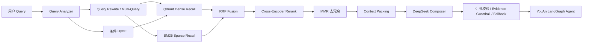

# YouAnRAG

面向灾害应急多智能体系统的完整 RAG 优化项目。项目从原有的单路 FAISS 相似度检索演进为可在 YouAn `DisasterResponseAgent` / LangGraph 中真实运行的检索、生成与评测链路，同时保留 Legacy 后端作为回退。

## 核心链路



## 已实现能力

- Markdown 结构感知分块，保留标题路径、chunk 上下文和稳定标识；
- BGE embedding + Qdrant Local 向量存储；
- SQLite 文档注册表与增量新增、修改、删除同步；
- BM25 关键词召回、Qdrant 语义召回与 RRF 融合；
- Cross-Encoder 精排、MMR 去冗余和上下文预算组装；
- Query Rewrite、Multi-Query 与条件 HyDE；
- DeepSeek 引用式回答、引用映射校验、证据约束与安全降级；
- Legacy/V2 双后端，可接入原 YouAn `DisasterResponseAgent`；
- Recall、MRR、nDCG、Faithfulness、Answer Relevancy、引用质量和 Fallback 评测。

## 最终实验结果

数据：51 份灾害 Markdown；25 条人工标注检索集；120 条固定种子随机鲁棒性集。真实评测在 RTX 4090 上完成。

| 检索指标 | Legacy | V2 Full | 提升 |
|---|---:|---:|---:|
| Doc Recall@10 | 0.8913 | **0.9348** | +4.35pp |
| Chunk Recall@5 | 0.5000 | **0.6304** | +13.04pp |
| Chunk Recall@10 | 0.5870 | **0.7609** | +17.39pp |
| Chunk MRR@10 | 0.3686 | **0.4639** | +9.53pp |
| Chunk nDCG@10 | 0.4092 | **0.5305** | +12.13pp |

随机鲁棒性集：Faithfulness **0.9702**、Answer Relevancy **0.9462**、Citation Correctness **0.9968**、Citation Completeness **0.9271**、OOD Fallback Accuracy **1.0000**、未知引用数 **0**。

> 随机集没有人工相关性标签，因此不报告 Recall。DeepSeek 同时作为 Composer 和 Judge，LLM-as-Judge 指标用于趋势分析；引用映射和 Fallback 指标由确定性程序计算。

完整报告：[`artifacts/stage7/after_fix/final_report.md`](artifacts/stage7/after_fix/final_report.md)。

## 目录

```text
src/rag_v2/                 RAG V2 核心实现
legacy_snapshot/RAG/        原 RAG 冻结快照
legacy_snapshot/multi_agent_server/  原 Agent 集成适配代码
scripts/                    构建、同步、搜索、评测与 AutoDL 脚本
experiments/                冻结评测集和阶段实验
artifacts/                  索引、报告和最终实验结果
tests/                      单元测试及 LangGraph 集成测试
```

## 快速验证

```bash
python -m pytest tests -q
python scripts/validate_stage7_eval_sets.py
python scripts/answer_stage7.py "台风黄色预警下学校应该怎么做？" --device cpu
```

启用真实 DeepSeek 前设置：

```bash
export DEEPSEEK_API_KEY="your-key"
```

AutoDL 正式评测命令保存在 `scripts/run_stage7_autodl.sh`；阶段 7.4 修复校准流程保存在 `scripts/run_stage74_calibration_autodl.sh`。

## 结果边界

- 当前知识库只有 51 份灾害文档，领域内随机问题的回答覆盖率为 0.78；证据不足时系统主动降级，而不是无依据生成。
- V2 Full 以效果为主，平均端到端延迟约 9 秒，生产化可进一步通过缓存、模型服务化和 Rewrite/HyDE 路由优化降低延迟。
- 项目没有把无标签随机集包装成准确率测试，也保留了 partial、fallback 和低分案例。
