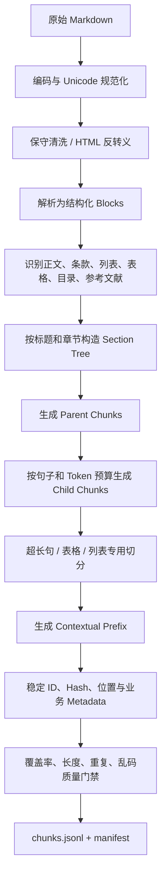
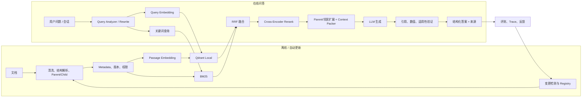

# “佑安”RAG 完整分阶段优化方案

> 适用范围：`Youan-AI-main/youan-multiagent/multi_agent_server/app/RAG` 及其在预案 Agent 中的调用链。  
> 当前阶段：**阶段 0~7 已在隔离项目 `G:\tiaozhanbei\newrag` 中完成并正式收口；RAG V2 已通过原 R Agent / LangGraph 真实集成，并完成 AutoDL 最终评测。**  
> 后续实施原则：继续只在隔离项目中开发、测试和评测；原 `Youan-AI-main` 目录保持不变，默认继续运行 legacy RAG。

---

## 1. 结论先行

当前 RAG 的问题不只是“没有向量数据库、没有 HyDE”，而是从数据处理到检索评测都缺少工程闭环：

1. 文档切分存在严重长块、结构丢失和内容截断；
2. BGE instruction 使用方向与模型说明相反，需要重建索引；
3. 只有单路 dense Top-K，没有关键词召回、精排、去重、过滤和上下文组装；
4. 返回值只有字符串，没有来源、分数和稳定 chunk ID，无法支撑可信引用；
5. 没有离线评测集，无法证明 MMR、HyDE 或 reranker 是否真的提升；
6. FAISS 对当前 4540 个 chunk 并不是性能瓶颈，但它缺少文档变更检测、增量 Upsert/Delete、元数据过滤和数据库式管理；本次优化将 **Qdrant Local Mode 确定为 V2 轻量级向量数据库**，本地磁盘持久化且不需要额外启动服务，用于实现自动更新和可运营的知识库；
7. HyDE 在应急政策场景可能引入“假设答案偏差”，应作为可选召回分支，而不是默认替换原查询。

因此建议的实施顺序是：

```text
隔离复制与接口冻结
→ 建立评测基线
→ 修复数据清洗、切分和 BGE 编码
→ Qdrant Local + SQLite Registry + 自动更新
→ Dense + BM25 混合召回
→ 结构化返回、引用与上下文组装
→ Cross-encoder 精排与 MMR 多样性控制
→ Query Analyzer / Query Rewrite / Multi-Query / 条件 HyDE
→ Agent 集成、可信回答与轻量观测
```

其中“数据质量、评测、混合检索、精排”仍是相关性提升的基础；Qdrant Local Mode 与自动更新作为本次 V2 的确定建设内容，主要解决知识库持续更新、过滤和版本管理问题，而不是把“换数据库”本身当成相关性优化。后续需要多进程或远程访问时，可以在保持存储适配器接口不变的情况下迁移到 Qdrant Server。

---

## 2. 已审计的代码范围

### 2.1 RAG 核心代码

| 文件 | 当前职责 | 主要问题 |
|---|---|---|
| `app/RAG/read.py` | Markdown 清洗、切句、生成 `md_chunks.json` | 按字符切分、无 overlap、长句不硬切、删除全部空白与结构 |
| `app/RAG/databse.py` | BGE 编码、构建 FAISS、保存 metadata | 文件名拼写错误；passage 错加 instruction；脚本导入即执行；无 manifest |
| `app/RAG/retreiver.py` | 在线加载模型、FAISS Top-K、返回原文 | 文件名拼写错误；instruction 参数未使用；无来源/阈值/过滤/精排 |
| `app/RAG/search.py` | CPU 手工查询和结果打印 | 与主 Retriever 重复实现；仅适合人工调试；把 L2 距离称为“相似度” |
| `app/RAG/test.py` | 测试单句 embedding | 不是自动化测试，没有断言 |
| `app/RAG/__init__.py` | 包标记 | 空文件 |

### 2.2 RAG 调用与集成代码

| 文件 | 与 RAG 的关系 |
|---|---|
| `app/agents/disaster_response_agent.py` | `retrieve_node` 调用 `RAG.invoke`，`propose_node` 将 `List[str]` 直接拼接进提示词 |
| `app/main.py` | 组装 `rag_config` 并在 FastAPI lifespan 初始化预案 Agent |
| `agents/plan_agent.py` | 旧版预案 Agent，复制了相同 RAG 调用方式 |
| `agents/scheme_agents.py` | 另一套旧版方案 Agent/RAG 实验代码 |
| `agents/test.py` | 旧版 Agent 集成测试脚本 |
| `tests/run_rag.py` | Top-100 检索后按来源文件去重并输出 demo |
| `demo.md` | 历史检索结果与方案示例，可作为人工回归参考，但不是标准评测集 |

### 2.3 数据和模型资产

| 资产 | 当前情况 |
|---|---|
| `final_mds/` | 51 份政策、预案、规范、案例和论文 Markdown |
| `md_chunks.json` | 4540 个 chunk |
| `chunk_metadata.json` | 与 `md_chunks.json` 当前内容完全相同 |
| `faiss_index.index` | `IndexFlatL2`，1024 维，4540 条向量，约 17.7 MiB |
| `bge-large-zh-v1.5/` | 本地模型约 1.21 GiB |

---

## 3. 当前链路与接口合同


当前对调用方最重要的兼容合同是：

```python
RAG(
    model_path: str,
    faiss_index_file: str,
    metadata_file: str,
    instruction=None,
)

search(query, top_k=10) -> (ids, distances)
invoke(query, top_k=10) -> List[str]
```

后续 V2 必须提供兼容适配器，保证 `disaster_response_agent.py` 在不修改的情况下仍能得到 `List[str]`。更丰富的结果通过新方法提供，而不是直接破坏旧接口。

---

## 4. 数据审计结果

本次只读取现有 JSON 和索引，没有修改任何文件。

### 4.1 Chunk 统计

| 指标 | 实测值 |
|---|---:|
| 文档数 | 51 |
| Chunk 数 | 4540 |
| 最短 chunk | 9 字符 |
| 中位数 | 222 字符 |
| P90 | 248 字符 |
| P95 | 276 字符 |
| 平均值 | 266.6 字符 |
| 最长 chunk | 67,367 字符 |
| 超过配置上限 250 字符 | 270 个 |
| 小于 50 字符 | 27 个 |
| 完全重复的额外 chunk | 44 个，分布在 40 组 |
| 单一来源最大占比 | 543 / 4540，约 12% |

### 4.2 长块是当前最高优先级缺陷

`read.py` 只有在“把新句子加入当前块”时才检查上限。如果单个句子本身超过 250 字符，它会被整体保留，因此出现：

- 67,367 字符的英文气候报告块；
- 38,604 字符的参考文献块；
- 19,961、15,694 字符的目录/论文块；
- 多个数千字符的表格或参考文献块。

建库时 tokenizer 使用 `max_length=512, truncation=True`，超长 chunk 只有开头被编码；但被检索后却可能把完整的数万字符放入 LLM 提示词。这会同时造成：

1. 向量无法代表完整 chunk；
2. chunk 后半部分永远不可检索；
3. 一旦命中会挤爆上下文预算；
4. 目录、参考文献、表格噪声可能获得错误高分。

### 4.3 清洗过程破坏文本结构

`clean_markdown` 执行：

```python
text = re.sub(r'\s+', '', text).strip()
```

它删除了所有空格和换行：

- 英文单词粘连，语义质量显著下降；
- 标题、段落、列表、表格层级消失；
- 章节名称无法作为 chunk 的上下文；
- 政策条款与编号容易被拼在一起；
- HTML entity、公式和 PDF 转换噪声仍可能残留。

### 4.4 元数据不足

当前每个 chunk 只有：

```json
{
  "source_file": "文件名.md",
  "chunk_index": 17,
  "content": "..."
}
```

建议补充：

- `document_id`、稳定 `chunk_id`、内容 hash；
- 标题、章节路径、父块 ID、字符/Token 区间；
- 灾种、区域、灾害阶段、文档类型；
- 发布机构、发布日期、生效/失效状态、权威等级；
- 数据版本、解析器版本、embedding 模型版本；
- 原始文件校验和、入库时间。

这些信息不仅用于展示来源，还能支持 metadata filter、增量更新、过期政策过滤和评测复现。

---

## 5. Embedding 与 FAISS 审计

### 5.1 BGE instruction 使用方向错误

当前 `databse.py` 对每个 passage 执行：

```python
texts = [instruction + chunk["content"] for chunk in chunks]
```

而 `retreiver.py` / `search.py` 对 query 不加 instruction。

本地 `bge-large-zh-v1.5/README.md` 明确说明：

- 短 query 检索长 passage 时，建议给 **query** 加 instruction；
- passage **不需要** instruction；
- v1.5 不加 instruction 也能工作，但应通过本项目评测选择。

因此旧版优化文档中“查询与文档都加同一个 instruction”也不准确。正确候选方案应通过 A/B 评测决定：

```text
A：query = instruction + 原查询；passage = 原文
B：query = 原查询；passage = 原文
```

无论选 A 还是 B，都需要重新生成 passage embedding 和新索引；不能只改在线 query 就宣称修复完成。

### 5.2 Score 语义需要统一

当前使用单位归一化向量和 `IndexFlatL2`。FAISS 返回的是平方 L2 距离：

```text
distance² = 2 - 2 × cosine_similarity
```

对于单位向量，平方 L2 理论范围是 `[0, 4]`，越小越相关。旧文档中“L2 范围 `[0, 2]`”不准确，也不能未经标注集校准就固定 `threshold=1.0`。

建议在 V2 内部统一为“越大越相关”的分数，例如：

```text
similarity = 1 - distance² / 2
```

同时保留原始距离，避免调试信息丢失。

### 5.3 FAISS 不是当前相关性瓶颈

当前只有 4540 个 1024 维向量，`IndexFlatL2` 是精确穷举搜索：

- 它不会因为近似索引而漏召回；
- 索引只有约 17.7 MiB；
- 当前主要问题来自 chunk、编码、召回策略和精排，而非最近邻计算速度。

FAISS 是向量检索库，不是完整向量数据库。它缺少服务化 CRUD、metadata filtering、版本管理、并发访问、权限、备份和监控。因此“引入向量数据库”的主要收益是工程能力与可运营性，而不是自动提高语义相关度。

### 5.4 其他问题

- `instruction` 构造参数没有在 `RAG` 类中实际使用；
- 建库脚本使用 FP16/自动设备，`search.py` 使用 CPU FP32，实验口径不统一；
- 没有验证 `index.ntotal == len(metadata)`、维度、模型版本和 checksum；
- 相对路径依赖当前工作目录，不是脚本目录；
- 脚本顶层直接执行，无法安全 import 和单元测试；
- 没有批量查询、embedding 缓存、并发控制或超时；
- `top_k > ntotal` 时 FAISS 可能返回 `-1`，当前代码没有过滤；
- 模型约 1.21 GiB，在 FastAPI 进程中直接加载，部署资源与并发需要管理。

---

## 6. 检索和生成链路缺陷

### 6.1 只有单路 Dense 召回

Dense retrieval 擅长语义相似，但应急政策问题经常包含：

- 预警颜色、响应等级；
- “24 小时 100 毫米”等精确数字；
- 法规名称、部门名称、行政区域；
- 专业术语和条款编号。

这些信息适合 BM25/关键词检索。只用 dense 容易错过精确匹配，因此混合检索通常比单纯换向量数据库更有价值。

### 6.2 无候选精排

双塔 embedding 独立编码 query 和 passage，适合粗召回；最终 Top-K 未经过 query-passage 联合建模。应加入 cross-encoder reranker，将 Top-30/50 精排到 Top-8/10。

### 6.3 无去重和多样性控制

相邻 chunk 和同一来源可能占满 Top-K。当前 `tests/run_rag.py` 通过“每个文件只保留一个结果”人工去重，说明团队已经遇到来源同质化问题，但该策略没有进入正式 Retriever。

不能只追求“来源越多越好”：如果问题明确询问某一份法规，同一文档多个条款可能都相关。应将 MMR、每源上限和相邻块合并做成可配置策略，并以 nDCG/Recall 和答案质量决定参数。

### 6.4 无上下文预算与引用

`propose_node` 当前执行：

```python
context = "\n\n".join(state["documents"])
```

没有：

- source/chunk 标记；
- token budget；
- 相邻块合并；
- 重复内容压缩；
- 按相关度截断；
- 引用映射；
- “检索不足时不回答”的策略。

因此 PPT 中“决策可溯源”目前没有被代码真正实现。

### 6.5 无系统评测

当前 `search.py`、`test.py` 和 `run_rag.py` 都是人工脚本，没有 query、relevant document/chunk、指标和断言。没有评测集时，任何“加了 HyDE/MMR 后提升明显”的说法都不可验证，也不能安全写到简历。

### 6.6 当前集成配置还存在路径问题

`app/main.py` 将 embedding 模型配置为：

```text
multi_agent_server/models/bge-large-zh-v1.5
```

但本次目录检查发现该路径不存在，实际模型位于：

```text
multi_agent_server/app/RAG/bge-large-zh-v1.5
```

这可能导致统一服务在 lifespan 初始化 RAG 时失败。V2 应使用基于配置文件和 `Path(__file__)` 的绝对路径解析，并在启动时执行模型、索引、metadata 的完整健康检查。旧版 `agents/` 中部分代码还引用不存在的 `youan-multiagent/RAG` 相对位置，应作为 legacy 快照保留，但不应继续作为新实现入口。

---

## 7. 隔离目录与“不影响现有项目”的实施设计

### 7.1 后续实施时的新目录

建议在仓库根目录下新建：

```text
Youan-AI-main/
└─ rag-optimization-v2/
   ├─ README.md
   ├─ legacy_snapshot/                 # 原始相关代码快照，只读
   │  └─ Youan-AI-main/                # 保留原相对路径
   ├─ src/rag_v2/
   │  ├─ config.py
   │  ├─ schemas.py
   │  ├─ ingestion/
   │  │  ├─ markdown_parser.py
   │  │  ├─ chunker.py
   │  │  ├─ metadata.py
   │  │  └─ dedup.py
   │  ├─ embedding/
   │  │  └─ bge_embedder.py
   │  ├─ stores/
   │  │  ├─ base.py
   │  │  ├─ faiss_store.py
   │  │  ├─ qdrant_store.py            # V2 本地持久化主存储
   │  │  └─ bm25_store.py
   │  ├─ sync/
   │  │  ├─ registry.py
   │  │  ├─ scanner.py
   │  │  ├─ change_detector.py
   │  │  ├─ sync_service.py
   │  │  ├─ scheduler.py
   │  │  └─ events.py
   │  ├─ retrieval/
   │  │  ├─ dense.py
   │  │  ├─ hybrid.py
   │  │  ├─ fusion.py
   │  │  ├─ reranker.py
   │  │  ├─ diversity.py
   │  │  └─ query_transform.py
   │  ├─ context/
   │  │  ├─ packer.py
   │  │  └─ citation.py
   │  ├─ legacy_adapter.py
   │  └─ service.py
   ├─ scripts/
   │  ├─ build_index.py
   │  ├─ sync_index.py
   │  ├─ search_cli.py
   │  └─ evaluate.py
   ├─ tests/
   │  ├─ unit/
   │  ├─ integration/
   │  └─ regression/
   ├─ eval/
   │  ├─ queries.jsonl
   │  ├─ qrels.jsonl
   │  └─ reports/
   ├─ configs/
   │  ├─ legacy.yaml
   │  ├─ faiss_hybrid.yaml
   │  └─ qdrant_hybrid.yaml
   └─ artifacts/                       # 新索引；不提交大文件
```

### 7.2 “所有 RAG 相关代码”的复制清单

后续第一步只复制，不修改原文件，并保留原目录结构：

```text
app/RAG/__init__.py
app/RAG/read.py
app/RAG/databse.py
app/RAG/retreiver.py
app/RAG/search.py
app/RAG/test.py
app/agents/disaster_response_agent.py
app/main.py
agents/plan_agent.py
agents/scheme_agents.py
agents/test.py
tests/run_rag.py
demo.md
requirements.txt
prediction/requirements.txt            # 只做依赖冲突参考，不作为 RAG 依赖
```

另外记录但不必复制 1.21 GiB 模型：

- `final_mds/`：先按只读数据源引用，V2 产物输出到新目录；
- `bge-large-zh-v1.5/`：通过配置引用，不复制模型权重；
- 旧 JSON/FAISS：复制或引用只读副本均可，但绝不覆盖；
- 为所有源文件、模型、旧索引生成 SHA-256 manifest。

这里的“所有代码”与“大体积模型/数据资产”分开处理，既满足隔离要求，又避免无意义复制约 1.3 GiB 权重。

### 7.3 兼容与切换策略

1. 原项目默认仍使用 `app/RAG/retreiver.py`；
2. V2 提供 `LegacyCompatibleRAG`，保留旧构造参数、`search` 和 `invoke -> List[str]`；
3. 新接口另设 `retrieve -> List[RetrievedChunk]`；
4. 通过环境变量或配置切换：

```text
RAG_IMPLEMENTATION=legacy    # 默认
RAG_IMPLEMENTATION=v2
RAG_VECTOR_STORE=qdrant|faiss       # V2 默认 qdrant，faiss 为降级
QDRANT_MODE=local
QDRANT_LOCAL_PATH=./artifacts/qdrant_local
RAG_ENABLE_HYDE=false
RAG_ENABLE_RERANKER=false
RAG_AUTO_SYNC=true
RAG_SYNC_INTERVAL_SECONDS=300
```

5. 在没有通过回归测试前，不修改 `disaster_response_agent.py` 的 import；
6. 最终集成采用 shadow read：legacy 结果继续服务用户，V2 只记录对比结果；
7. 发现错误可立即把开关切回 legacy，不需要重建原索引。

---

## 8. 分阶段优化路线

## 阶段 0：隔离、冻结接口、建立可复现基线

### 目标

保证后续所有开发不触碰现有项目，并能快速建立可量化对比基础。该阶段不追求完整工程化治理，重点是用较小成本得到一个可复现、可对比的 legacy baseline。

### 工作项

1. 按第 7 节复制全部相关代码到 `rag-optimization-v2/legacy_snapshot`，后续开发只在新目录中进行；
2. 确认原项目 `git status` 干净，并记录 legacy RAG 关键代码文件的 hash，作为“不改原代码”的核验依据；
3. 固化 legacy API 行为：构造、`search`、`invoke`、异常情况，明确 V2 兼容边界；
4. 建立第一版轻量评测集，并写一个约 10 行的 `evaluate.py` 循环脚本，遍历评测 query 集，输出每条 query 的 Top-10 结果和 recall 统计。

### 评测集建议

先建立 20~30 条 query，覆盖最能体现差异的典型问题即可，按下列维度适度分层：

- 灾种：台风、暴雨洪涝、地震、地质灾害、干旱等；
- 阶段：灾前预警、灾中响应、灾后恢复；
- 粒度：短问句、详细情景、精确条款/数字问题；
- 地域：全国政策、广东/深圳、湖北、云南等；
- 意图：行动建议、响应等级、资源调度、灾损统计、历史案例；
- 负例：知识库无答案、歧义问题、非灾害问题。

每个 query 只标注 2 项：

- 相关文档文件名；
- 至少 1 个强相关 chunk 的 `chunk_index`。

### 指标

- 检索：Recall@5/10/20、MRR@10、nDCG@10、Precision@K；
- 多样性：Unique Sources@K、重复率、相邻块重复率；
- 性能：p50/p95 latency、吞吐、峰值内存；
- 生成：faithfulness、citation correctness、答案完整度；
- 工程：索引构建时间、增量更新耗时、失败率。

### 验收标准

- Legacy 评测报告可一条命令复现；
- 后续任何优化必须提供与 legacy 的消融对比；
- 原代码 hash 不变。
---

## 阶段 1：修复数据管道与索引正确性

### 目标

在不引入高级检索算法前，先保证“被索引的文本是正确、完整、语义自洽、长度受控、可定位、可增量更新的”。当前最长 chunk 达 67,367 字符，因此分块不是普通代码整理，而是整个 RAG 优化的 P0 基础。

### 1.1 分块设计原则

1. **先尊重文档结构，再满足长度限制**：标题、章节、条款、列表、表格是天然语义边界；不能先把全文压成一行再按字符截断。
2. **按 Token 而不是字符控制长度**：embedding 模型的限制是 Token 数；中文、英文、数字、公式的字符/Token 比不同。
3. **检索块和生成上下文分离**：短 child 用于精确召回，较完整 parent 用于回答，避免用一个尺寸同时满足两个目标。
4. **正文和索引文本分离**：`content` 保存可引用原文；`embedding_text` 可以增加标题和章节前缀，但不得篡改证据正文。
5. **不同结构使用不同策略**：政策条款、叙述段落、表格、目录和参考文献不能使用同一种切分规则。
6. **所有参数必须通过评测选择**：不存在对所有文档通用的“最佳 300 tokens”；需要对 chunk size、overlap、parent size 做网格实验。
7. **支持局部稳定更新**：修改一段文字不应导致整份文档后续所有 chunk ID 改变，否则无法有效复用 embedding。
8. **任何清洗与丢弃都必须可审计**：记录原始位置、处理规则和丢弃原因，不能静默删除可能有价值的条款。

### 1.2 新分块流水线



实现上不要继续在 `read.py` 中堆叠正则，建议拆成：

```text
ingestion/
├─ loader.py                 # 读取与编码检测
├─ normalizer.py             # Unicode、空白、HTML entity
├─ markdown_parser.py        # Markdown → Blocks/Section Tree
├─ block_classifier.py       # 正文/列表/表格/目录/参考文献
├─ sentence_splitter.py      # 中英文句界
├─ token_counter.py          # 使用实际 embedding tokenizer
├─ chunker.py                # Parent/Child 主策略
├─ table_chunker.py
├─ quality.py
├─ metadata.py
└─ dedup.py
```

### 1.3 文本规范化：必须“保守”而不是“清空空白”

当前 `re.sub(r'\s+', '', text)` 必须移除。推荐：

- 统一换行符为 `\n`；
- Unicode 规范化，处理全角/半角、不可见字符和软连字符；
- 使用 `html.unescape` 处理 `&amp;`、`&lt;` 等实体；
- 英文连续空白压缩为一个空格，但保留词间空格；
- 中文段落保留换行，不把标题、列表、条款粘连；
- 保留 `Ⅰ/Ⅱ/Ⅲ/Ⅳ`、条款号、日期、数值单位等检索关键内容；
- 识别重复页眉、页脚和页码，在确认重复模式后删除；
- 公式、链接和图片说明以可读占位或原文本保存；
- 清洗前后都保留 hash，并记录 normalizer 版本。

不能直接删除所有“看起来像乱码”的内容。应计算 `quality_score` 并进入隔离报告，人工确认后再决定是否排除。

### 1.4 结构化 Block 模型

解析后先得到 Block，而不是直接得到 chunk：

```python
@dataclass
class DocumentBlock:
    block_id: str
    block_type: str        # heading/paragraph/list/table/formula/reference/toc
    text: str
    heading_level: int | None
    section_path: list[str]
    source_start: int
    source_end: int
    order: int
    metadata: dict
```

Section Tree 示例：

```text
深圳市气象灾害应急预案
└─ 4 应急响应
   └─ 4.4 分灾种响应
      └─ 4.4.1 台风、大风
```

每个 child 都继承完整 `section_path`。这样检索“台风应急响应”时，即使正文只写“有关部门应当……”，embedding 仍然知道它属于台风章节。

### 1.5 Child Chunk：用于检索

第一轮建议从以下参数开始做网格实验，而不是直接固定：

| 参数 | 起始候选 | 说明 |
|---|---:|---|
| 目标长度 | 220 / 280 / 320 tokens | 比较 Recall 与上下文完整性 |
| Soft Max | 320 / 384 tokens | 优先在句末或块末结束 |
| Hard Max | 448 tokens | 包含 contextual prefix 后也不能超过；为 512 上限留余量 |
| 最小长度 | 50~80 tokens | 过短正文优先与同节相邻块合并 |
| Overlap | 32 / 48 / 64 tokens | 只在句子边界创建，通常不超过正文的 20% |

分块算法：

1. 在同一 section 内依次加入完整 Block；
2. 加入后未超过 target，继续累积；
3. 超过 target 但未超过 soft max，优先在当前段落/句子结束；
4. 超过 soft max，回退到最近合法边界；
5. 单个 Block 超过 hard max，进入专用递归切分；
6. 生成有限 overlap，且 overlap 不跨章节；
7. 如果尾块过短，与前一块合并或重新平衡，而不是单独产生低质量块。

伪代码：

```python
def build_child_chunks(blocks, tokenizer, target, soft_max, hard_max):
    chunks, current = [], []
    for block in blocks:
        units = split_oversized_block(block, tokenizer, hard_max)
        for unit in units:
            if token_len(current + [unit]) <= target:
                current.append(unit)
            elif token_len(current + [unit]) <= soft_max and should_keep_together(unit):
                current.append(unit)
            else:
                chunks.append(finalize(current))
                current = sentence_boundary_overlap(current) + [unit]
    if current:
        chunks.append(finalize_or_rebalance(current, chunks))
    return chunks
```

### 1.6 Parent-Child / Small-to-Big 策略

建议同时生成两层：

- **Child**：约 220~320 tokens，用于 Dense、BM25 和 reranker；
- **Parent**：约 700~1200 tokens，通常对应完整小节，用于命中后补全上下文；
- `parent_id`：将 child 关联到 parent；
- `prev_chunk_id/next_chunk_id`：允许按需扩展邻居。

检索时不应无条件返回整个 parent：

```text
Child 命中
→ 判断该问题是否需要上下文扩展
→ 取 Parent 或同节 ±1 邻居
→ 去重并按 Token Budget 装箱
```

对于精确数字/条款问题，child 往往已经足够；对于“制定完整台风响应方案”，可以扩展 parent 或邻居。这样比始终索引大块或始终返回小碎片更合理。

### 1.7 Contextual Prefix

用于 embedding 的文本建议为：

```text
[文档] 深圳市气象灾害应急预案
[章节] 4 应急响应 > 4.4 分灾种响应 > 4.4.1 台风、大风
[类型] 政府应急预案
[正文] 气象部门加强监测预报……
```

同时分别保存：

```json
{
  "content": "气象部门加强监测预报……",
  "embedding_text": "[文档] ... [正文] ..."
}
```

最终引用展示 `content`，不能把系统生成的前缀误当原文。Contextual Prefix 优先采用确定性 metadata；LLM 生成“块背景摘要”可以作为后续消融项，但不应成为第一版，因为它成本高、不可完全复现且可能加入错误信息。

### 1.8 政策、预案和规范的专用策略

项目知识库以政策/预案为主，应优先做 clause-aware chunking：

- 标题和条款编号与条款正文不可分离；
- 一条较短条款可与相邻同级条款组合；
- 一条较长条款按其子项 `（一）/1./①` 切分；
- 响应等级、预警颜色、责任部门、数字阈值作为 metadata 实体保留；
- 不能让“Ⅲ级响应”的标题落在上一块、启动条件落在下一块；
- 引用时保留文件名、章节和条款号。

建议为以下模式建立解析规则和测试样例：

```text
第X章 / 第X条
1 / 1.1 / 1.1.1
（一）/ 1）/ ①
Ⅰ级 / Ⅱ级 / Ⅲ级 / Ⅳ级
蓝色 / 黄色 / 橙色 / 红色预警
```

### 1.9 表格专用策略

当前长块中包含大量灾情统计表。表格不能当作一个超长句处理：

1. 识别表名、表头和数据行；
2. 每个 chunk 重复表名与表头；
3. 按完整行分组，不能从单元格中间截断；
4. 宽表转为“字段名: 值”的行式文本用于 embedding；
5. 原始 Markdown 表格另存用于引用展示；
6. 跨页续表合并时保留同一 `table_id`；
7. 对代码表、统计指标表建立字段级 metadata。

例如：

```text
[表] 自然灾害损失情况统计快报表
[字段] A01008
[指标名称] 因灾死亡人口
[计量单位] 人
```

这会显著改善“因灾死亡人口对应哪个指标代码”之类精确问题的关键词与语义检索。

### 1.10 列表、目录、参考文献和公式

#### 列表

- 列表标题与列表项放在一起；
- 单个列表项太长时按句切分，但重复列表标题；
- 不跨 section 合并列表项。

#### 目录

- 纯目录通常不参与正文检索；
- 目录可用于修复章节树，但应标记 `indexable=false`；
- 避免目录标题与正文标题重复占据 Top-K。

#### 参考文献

- 默认单独分类，降低权重或不进入主应急问答索引；
- 用户明确检索论文/作者时，路由到 reference index；
- 不能让数万字符参考文献作为一个 chunk。

#### 公式

- 保留公式附近的定义与变量说明；
- 公式过长时保持完整，并将解释段与公式建立关联；
- 纯乱码公式进入质量报告。

### 1.11 超长单句与递归兜底

任何 Block 最终都必须通过 Hard Max 门禁。递归边界优先级：

```text
章节边界
→ 段落边界
→ 列表项/表格行
→ 中文或英文句子
→ 分号、逗号、冒号
→ Token 滑窗硬切
```

最后一级 Token 滑窗只作为兜底，并记录：

```text
split_reason=hard_token_fallback
```

这能确保不再出现单个 67,367 字符 chunk。

### 1.12 Overlap 设计

Overlap 可以减少边界信息丢失，但会制造重复召回。规则：

- 只复制完整句子或完整列表项；
- 不跨章节、不跨表格；
- overlap 比例设置上限；
- metadata 记录 `overlap_source_chunk_id`；
- 检索后对相邻/重叠块进行 collapse；
- 评测同时关注 Recall 提升和 Top-K 重复率。

不要使用固定“后 80 个字符复制到下一块”的方式，因为它可能切断英文单词、数字和条款。

### 1.13 稳定 ID 与自动更新

不能继续用全局 `chunk_index` 作为身份。建议：

```text
document_id      = UUID5(normalized_relative_path)
document_version = SHA256(raw_document)
block_id         = UUID5(document_id + stable_section_anchor + local_block_anchor)
chunk_id         = UUID5(block_id + normalized_content_hash + chunker_version)
```

关键点：

- `document_id` 在文档内容修改后仍保持稳定；
- `document_version` 随内容改变；
- 未修改章节的 block/chunk 尽量保持 ID；
- 不将“该块在全文中的序号”作为唯一 ID，否则开头插入一段会让后续全部失效；
- Qdrant 使用稳定 chunk UUID Upsert；
- Embedding Cache 使用 `embedding_text_hash + model_version`；
- 修改文档时只对变化 chunk 重算向量，并删除消失的旧 chunk。

### 1.14 Chunk Metadata

每个 chunk 至少包含：

```json
{
  "chunk_id": "...",
  "parent_id": "...",
  "document_id": "...",
  "document_version": "...",
  "source_file": "...",
  "title": "...",
  "section_path": ["..."],
  "clause_number": "4.4.1",
  "block_types": ["paragraph", "list"],
  "content": "...",
  "embedding_text": "...",
  "content_hash": "...",
  "embedding_text_hash": "...",
  "token_count": 286,
  "source_start": 10240,
  "source_end": 11780,
  "prev_chunk_id": "...",
  "next_chunk_id": "...",
  "disaster_types": ["台风"],
  "regions": ["深圳市"],
  "stages": ["灾前预警", "灾中响应"],
  "document_type": "应急预案",
  "quality_score": 0.96,
  "parser_version": "...",
  "chunker_version": "..."
}
```

### 1.15 Semantic Chunking 的定位

可以加入语义分块，但不建议一开始替代结构化分块。

推荐做法：

1. 先按标题、段落、条款获得结构边界；
2. 只在一个 section 内，对相邻段落 embedding 相似度进行分析；
3. 当语义突变且长度已经达到最小值时建立边界；
4. 仍必须遵守 Hard Max；
5. 与纯结构化策略做消融。

风险：

- 需要额外 embedding 成本；
- 阈值对不同文档不通用；
- 相似度平滑时可能产生超长块；
- 政策相邻条款措辞相似，但职责不同，纯语义算法可能错误合并；
- 结果稳定性降低，不利于增量更新。

所以优先级为：**结构感知 + Token 预算 > Parent-Child > 专用表格/条款处理 > 可选 Semantic Chunking > LLM Chunking**。

### 1.16 不建议第一版使用 LLM 全量分块

让 LLM 判断所有边界看起来智能，但存在：

- 处理 51 份长文档成本高；
- 输出不完全确定，索引难复现；
- 可能改写或遗漏原文；
- 增量更新后边界可能大面积漂移；
- 很难证明比规则+结构策略稳定提升。

LLM 更适合做离线 metadata 提取、文档分类或低质量块修复建议，而不是第一版主分块器。

### 1.17 分块质量门禁

每次构建必须生成 `chunk_quality_report.json`，至少检查：

- `token_count <= hard_max` 的比例必须为 100%；
- 空块、极短块、异常长块数量；
- 原文覆盖率与被排除文本比例；
- 重复 chunk 与近重复 chunk 比例；
- 英文无空格粘连比例；
- HTML entity、乱码符号、页眉页脚残留；
- 每份文档 chunk 数及异常偏差；
- section_path 缺失比例；
- 表格、条款解析成功率；
- chunk ID 稳定性；
- embedding_text 实际 Token 分布。

构建失败条件示例：

```text
存在超过 hard_max 的 chunk
或 indexable 正文覆盖率低于阈值
或 source span 重叠/缺失异常
或 chunk_id 冲突
或 chunk 数相对上一版本异常突增/骤降
```

### 1.18 分块消融实验

至少比较：

| 实验 | 策略 |
|---|---|
| A | 现有 250 字符分块 |
| B | 结构感知，256 tokens，无 overlap |
| C | 结构感知，256 tokens，48-token overlap |
| D | 结构感知，320 tokens，48-token overlap |
| E | Parent-Child：256 child + 900 parent |
| F | E + Contextual Prefix |
| G | F + 可选 Semantic Boundary |

除 Recall@K、MRR、nDCG 外，还需要评估：

- Boundary QA：答案跨原段落边界时能否召回；
- Clause QA：响应等级、条款和数字是否完整；
- Table QA：字段、代码、单位能否正确召回；
- Citation Completeness：引用块是否包含完整支撑语句；
- Redundancy@K：overlap 是否导致重复结果；
- Context Tokens：达到相同答案质量所需上下文长度；
- Incremental Stability：小范围修改导致多少 chunk ID/embedding 变化。

最终参数按不同 query 类型也可以动态选择上下文扩展策略，但 ingestion 阶段的 chunk 版本必须固定、可复现。

### 验收标准

- 不再存在超过 Hard Max 的块，最长 67,367 字符问题完全消除；
- 英文空格、标题层级、列表、条款编号和表格表头可恢复；
- Indexable 正文覆盖率达到预设门槛，所有排除项有原因记录；
- 重复与近重复 chunk 有报告，overlap 不导致 Top-K 被相邻块占满；
- 每个结果能映射回源文件、章节、条款和原文位置；
- Child、Parent、邻居和引用关系正确；
- 小范围文档修改只使相关 chunk 失效，未变化 embedding 可以复用；
- Qdrant point payload 包含完整分块 metadata；
- 新索引与旧索引完全分离；
- Recall@K、nDCG、Citation Completeness 不低于 legacy，并给出分块消融报告；
- 分块构建和质量报告可以一条命令复现。

---

## 阶段 2：Qdrant Local 接入与 Markdown 知识库自动更新

### 目标

将阶段一产出的静态 `FAISS + chunk_metadata` 升级为 **Qdrant Local + SQLite DocumentRegistry** 的轻量向量知识库。阶段二不以提升语义相关性为目标，而是解决原项目知识库维护成本高的问题：新增、修改、删除 Markdown 后，不再依赖手工运行 `read.py` 和 `databse.py` 全量重建。

本阶段默认使用 Qdrant Local：

```python
QdrantClient(path="artifacts/qdrant_local")
```

同时在 `QdrantStore` 中保留 Server 连接配置，后续可迁移为：

```python
QdrantClient(url="http://localhost:6333")
```

SQLite 不替代 Qdrant，二者职责不同：

| 组件 | 职责 |
|---|---|
| Qdrant Local | 存储 chunk 向量、payload、metadata filter、upsert/delete、相似度检索 |
| SQLite DocumentRegistry | 记录文档 hash、chunk 映射和同步状态 |
| FAISS | 保留为阶段一静态 baseline 和 Qdrant 导入来源 |

### 2.1 Qdrant 基础设施

合并完成 Qdrant 配置、VectorStore 抽象和 QdrantStore 最小实现，避免阶段二被过细模块切碎。

新增：

```text
src/rag_v2/stores/vector_store.py
src/rag_v2/stores/qdrant_store.py
```

核心接口：

```python
class VectorStore(Protocol):
    def ensure_collection(self) -> None: ...
    def upsert_points(self, points) -> None: ...
    def delete_by_chunk_ids(self, chunk_ids: list[str]) -> None: ...
    def delete_by_source_file(self, source_file: str) -> None: ...
    def search(self, query_vector, top_k: int, filters=None) -> list[VectorSearchHit]: ...
    def count(self) -> int: ...
    def health(self) -> dict: ...
```

配置新增：

```text
qdrant_mode = local/server
qdrant_path = artifacts/qdrant_local
qdrant_url = None
qdrant_collection = youan_rag_stage2
stage2_artifacts_dir = artifacts/stage2
registry_db_path = artifacts/stage2/document_registry.sqlite3
```

### 2.2 从 Stage1 FAISS 导入 Qdrant

阶段二第一步不重新 embedding，而是复用阶段一已生成的：

```text
artifacts/stage1/faiss_index.index
artifacts/stage1/chunk_metadata.json
```

通过 FAISS `reconstruct(i)` 取回向量，并将同 index 的 metadata 作为 Qdrant payload 写入。这样本地 CPU 即可完成，不需要租 GPU。

point 设计：

```json
{
  "id": 0,
  "vector": [0.01, -0.02, 0.03],
  "payload": {
    "chunk_id": "深圳市气象灾害应急预案.md::48",
    "source_file": "深圳市气象灾害应急预案.md",
    "chunk_index": 48,
    "section_path_text": "3.3.3.2 Ⅳ级应急响应（一般）",
    "content": "……",
    "content_hash": "sha256...",
    "token_count": 320,
    "is_active": true
  }
}
```

导入报告：

```text
artifacts/stage2/qdrant_import_report.json
```

校验：

```text
Qdrant point_count == len(chunk_metadata) == FAISS index.ntotal
```

### 2.3 文档追踪：SQLite Registry + FileTracker

不做生产级审计系统，Registry 精简为两张表：

```text
documents
├─ source_file
├─ relative_path
├─ content_hash
├─ status: active/deleted/failed
├─ chunk_count
├─ updated_at
└─ last_error

chunk_mappings
├─ chunk_id
├─ source_file
├─ chunk_index
├─ content_hash
└─ qdrant_point_id
```

删除原计划中的 `sync_runs` 和 `kv_state`，避免过度工程化。

同时将原 `scanner.py + change_detector.py` 合并为：

```text
src/rag_v2/sync/file_tracker.py
```

包含：

```python
@dataclass
class FileSnapshot:
    source_file: str
    path: Path
    content_hash: str
    size: int

@dataclass
class FileChangeSet:
    added: list[FileSnapshot]
    modified: list[FileSnapshot]
    deleted: list[str]
    unchanged: list[FileSnapshot]
```

职责：扫描 Markdown 目录、计算 hash、与 Registry 对比得到 added/modified/deleted/unchanged。

### 2.4 同步脚本

不先抽象独立 `SyncService` 服务类，第一版把同步逻辑收敛在 CLI 脚本中：

```text
scripts/sync_qdrant_stage2.py
```

命令：

```powershell
python scripts/sync_qdrant_stage2.py --scan-only
python scripts/sync_qdrant_stage2.py --sync
python scripts/sync_qdrant_stage2.py --rebuild-all
```

处理规则：

| 变化 | 操作 |
|---|---|
| unchanged | 跳过 |
| added | 解析、分块、embedding、upsert、写 registry |
| modified | 删除该文件旧 points，重建该文件 chunks |
| deleted | 删除该文件 points，Registry 标记 deleted |

第一版按文档级重建，不做 chunk 级 embedding cache。少量新增/修改文档可用 CPU；如果 `--rebuild-all` 涉及全量 embedding，提前租 GPU。

### 2.5 Qdrant Searcher 与 Stage2 评测

新增：

```text
src/rag_v2/retrieval/qdrant_searcher.py
scripts/search_qdrant_stage2.py
evaluate_stage2.py
```

功能：

- 使用 BGE 编码 query；
- 调用 Qdrant Local 检索；
- 支持 payload filter，例如 `source_file`；
- 返回 `source_file`、`chunk_index`、`section_path_text`、`content_preview`；
- 提供 legacy adapter：`invoke() -> List[str]`。

阶段二评测目标不是提升 Recall，而是验证迁移完整性。因为 Qdrant 向量来自 Stage1 FAISS，同一查询的语义排序应基本一致。

主要指标改为：

```text
Stage1 Top-K 与 Qdrant Top-K 一致性 >= 99%
Qdrant point_count == metadata_count
payload 字段完整率 == 100%
filter 查询结果正确
```

### 2.6 阶段二收口

生成：

```text
docs/phase2_report.md
artifacts/stage2/README.md
```

报告内容：

1. Qdrant point 数量；
2. Registry document 数量；
3. 新增/修改/删除测试结果；
4. Stage1 与 Qdrant 检索一致性；
5. Qdrant Local 与 Qdrant Server 迁移说明；
6. 下一阶段 BM25 + RRF + context packing 计划。

### 验收标准

- 从 Stage1 FAISS 成功导入 Qdrant，point 数量与 metadata 对齐；
- Qdrant 检索 Top-K 能返回 `source_file`、`section_path_text`、`content_preview`；
- Stage1 Top-K 与 Qdrant Top-K 一致性达到 99% 以上；
- 新增 Markdown 后，执行同步命令可检索到新内容；
- 修改 Markdown 后，旧内容不再召回，新内容可召回；
- 删除 Markdown 后，对应 chunk 不再参与检索；
- 重复执行同步不会重复写入 point；
- SQLite Registry 能记录文档 hash 和 chunk 映射；
- 所有阶段二新增模块都有单元测试；
- 不修改阶段一 artifacts，阶段二产物写入 `artifacts/stage2` 和 `artifacts/qdrant_local`。

---
## 阶段 3：混合召回与上下文组装

### 目标

在 Qdrant dense 检索基础上，引入轻量 BM25、RRF 融合和上下文组装，让 Retriever 从“Top-K chunk 返回器”升级为可解释、可控、可直接供 Agent 使用的检索管线。

阶段三默认仍然保持“本地可跑、单人项目可收敛”的原则：

1. 不引入 Elasticsearch；
2. 不新增外部服务；
3. 继续复用阶段一 `chunk_metadata/chunks.jsonl` 与阶段二 Qdrant 检索接口；
4. 默认不需要 GPU；
5. 重点做 **dense-only → hybrid retriever** 的能力升级，而不是继续扩展基础设施。

### 3.1 新结果模型

阶段一和阶段二已经返回结构化检索结果，阶段三进一步统一为：

```python
@dataclass
class RetrievedChunk:
    chunk_id: str
    content: str
    source_file: str
    section_path: list[str]
    dense_score: float | None
    sparse_score: float | None
    fusion_score: float | None
    rank: int
    metadata: dict
```

兼容层继续把它投影为 `List[str]`，新 Agent 则直接使用结构化结果。

### 3.2 Dense + BM25 混合召回

建议两路并行：

```text
原查询
├─ Qdrant dense Top-50
└─ BM25 sparse Top-50
        ↓
      RRF 融合
        ↓
   候选 Top-30/50
```

BM25 第一版使用本地轻量实现，直接基于：

```text
artifacts/stage1/chunk_metadata.json
或
artifacts/stage1/chunks.jsonl
```

构建本地稀疏索引，不依赖 SQLite Registry，不引入 Elasticsearch。

阶段三第一版只要求：

- 支持全文词项匹配；
- 支持中文场景下的轻量 token 化；
- 能返回 `source_file/chunk_id/chunk_index`；
- 能与 dense Top-K 做 RRF 融合。

不要求这一阶段就做复杂 query understanding 或生产级倒排索引持久化。

### 3.3 Metadata filter

从 query 或上游 Agent 提取：

- 灾种；
- 地域；
- 灾害阶段；
- 文档类型；
- 来源文件名。

先做“软过滤/加权”，避免错误分类导致零召回；当用户明确指定“深圳市气象预案”时才做硬过滤。

第一版推荐只做以下几类：

1. `source_file`
2. 地域
3. 灾种
4. 文档类型

并采用两层策略：

```text
明确指定文件名 / 文档名      -> 硬过滤
一般主题、地域、灾种提示      -> 软过滤加权
```

这样可以避免错误分类直接导致零召回，也更适合简历项目讲解。

### 3.4 上下文组装

最终送入 LLM 前执行：

1. 合并相邻 chunk；
2. 去除重复与高度相似块；
3. 设置每来源上限，但允许指定文档例外；
4. 按 token budget 选择上下文；
5. 为每块分配 `[S1]`、`[S2]` 引用 ID；
6. 保留 source、section、chunk_id；
7. 相关证据不足时返回 `insufficient_evidence=True`。

阶段三第一版建议优先做：

```text
候选 chunk
→ 按 source_file + chunk_index 排序
→ 合并相邻 chunk
→ 按 section 限量补充 1~2 个 chunk
→ 去重
→ token budget 裁剪
→ 输出 evidence pack
```

也就是说，先做 **相邻 chunk 补全 + 同 section 限量补全**，暂不做更复杂的图式扩展。

### 3.5 阶段三评测口径

阶段三的重点不再是“与 Stage1 一致”，而是验证 hybrid retriever 是否真正优于 dense-only。

第一版建议重点看：

1. **关键词/条款/数字类 query** 的命中改善；
2. 指定文件名 / 指定地区问题的 filter 命中情况；
3. context packing 后 evidence 完整率；
4. dense-only 与 hybrid 的 Top-K 人工对比。

建议至少形成三类对比：

```text
dense-only
vs
BM25-only
vs
dense + BM25 + RRF
```

这样阶段四 rerank、阶段五 rewrite 才有稳定输入基础。

### 3.6 推荐拆分方式

为了保持和阶段一、阶段二一致的收敛性，阶段三建议继续拆成小阶段：

```text
3.1 BM25 本地索引与 sparse 检索
3.2 Dense + Sparse 融合（RRF）
3.3 Metadata 软过滤 / 硬过滤
3.4 上下文组装与 token budget
3.5 阶段三评测与收口
```

### 验收标准

- 关键词/条款/数字类问题的检索质量优于 dense-only；
- 最终上下文无超预算；
- 每个输出 evidence 块都保留来源 ID；
- legacy `invoke()` 回归通过；
- 阶段三默认不依赖 GPU。

---

## 阶段 4：Cross-Encoder 精排与多样性控制

### 目标

提升最终送入 LLM 的 Top-K 精度，同时控制同质化。

### 推荐顺序

```text
Dense/BM25 候选 Top-50
→ RRF 融合
→ Cross-encoder 精排 Top-20/30
→ MMR / 每来源上限 / 相邻块合并
→ Context Top-8/10
```

若 reranker 需要批量评测，建议使用 GPU；若只做小规模 demo，可以 CPU 跑通接口。

### Reranker 候选

- 中文优先：选择 BGE reranker 生态中轻量模型；
- 实现统一 `Reranker` 接口，支持关闭、CPU/GPU、batch size、timeout；
- 不在文档里锁死某一模型版本，以本地评测和部署资源决定。

### MMR 注意事项

- 多样性不是越高越好；
- 对法规精确问答应提高相关性权重；
- 对开放式应急预案可适度增加跨来源覆盖；
- MMR 使用的 candidate embedding 必须与新索引同版本。

### 验收标准

- MRR@10、rank_shift 相比阶段 3 更优；当前单点 binary 标注不强制使用 nDCG@10；
- 记录 reranker latency，并在报告中说明 CPU/GPU 下的延迟代价；
- 开关关闭时能退化回 hybrid retrieval；
- 失败或超时不阻断主请求。

---

## 阶段 5：Query Analyzer / Query Rewrite / Multi-Query / 条件 HyDE

### 阶段定位

阶段五建立在阶段四已收口的链路之上：

```text
Qdrant dense + BM25 sparse + RRF
→ Cross-Encoder rerank
→ MMR
→ ContextPacker
```

阶段五不再改底层索引、不重新 embedding、不改已有阶段 1~4 的默认入口，而是在检索入口前新增 **Query Planning 层**，解决短查询、口语化查询、复合问题和词汇不匹配问题。

本阶段的核心原则是：

1. **原查询永远保留**：rewrite/multi-query/HyDE 只能补充召回，不能替代 raw query；
2. **先确定性规则，后 LLM 能力**：第一版先实现无外部依赖的 Query Analyzer 和规则 rewrite；LLM rewrite/HyDE 通过可插拔接口接入；
3. **按 query 类型自适应**：阶段四评测已经证明关键词/条款 query 中 rerank 可能退化，因此阶段五要把 query type 识别结果用于检索策略路由；
4. **HyDE 条件开启**：HyDE 只对短、抽象、开放式 query 作为 dense 分支使用，生成内容不能进入最终 evidence/citation；
5. **DeepSeek 可选接入**：默认不调用外部 LLM，但保留 `--hyde-mode deepseek`，从环境变量 `DEEPSEEK_API_KEY` 读取密钥，支持真实 HyDE 评测；
6. **可回退**：LLM 不可用、rewrite 失败、超时或置信度低时，必须退回阶段四 raw query 检索链路。

### 5.1 Query Analyzer：先识别 query 类型和可用约束

新增 `QueryPlan` 结构，建议字段：

```python
class QueryPlan(BaseModel):
    original_query: str
    normalized_query: str
    query_type: Literal[
        "keyword",          # 条款、文件名、编号、明确术语
        "exact_fact",       # 明确事实/数字/等级/责任主体
        "scenario",         # 用户描述灾害场景，问该怎么办
        "multi_hop",        # 多个约束或多文档组合
        "ambiguous"         # 短、抽象、意图不清
    ]
    region_hint: str | None
    hazard_hint: str | None
    document_type_hint: str | None
    time_hint: str | None
    extracted_terms: list[str]
    rewrite_confidence: float
    retrieval_policy: RetrievalPolicy
```

`retrieval_policy` 用于控制后续策略：

```python
class RetrievalPolicy(BaseModel):
    use_rewrite: bool
    use_multi_query: bool
    use_hyde: bool
    use_reranker: bool
    use_mmr: bool
    dense_top_k: int
    sparse_top_k: int
    rerank_top_k: int
    branch_weights: dict[str, float]
```

默认 branch 权重：

```python
branch_weights = {
    "raw": 1.0,
    "normalized": 0.9,
    "expanded": 0.7,
    "hyde": 0.6,
}
```

`raw` 永远最高，HyDE 最低。

初始规则建议：

- 命中文件名、条款号、编号、年份、明确等级：`keyword/exact_fact`，保留 BM25 权重，默认不启用 HyDE；
- “怎么办、如何处置、怎么避险、应采取哪些措施”：`scenario`，启用 rewrite 和 multi-query，可启用 rerank/MMR；
- “这个、那边、该情况”等依赖上下文的问题：先不做复杂会话改写，标记 `ambiguous` 并保守检索；
- 识别置信度低时，不施加强 metadata filter，只作为 hint。

### 5.2 规则 Query Rewrite：低风险、无外部依赖

第一版不依赖 LLM，先实现确定性 rewrite：

1. **文本规范化**：全角/半角、罗马数字/中文数字、IV/Ⅳ、空格和标点归一；
2. **灾种同义词扩展**：台风/热带气旋、暴雨/洪涝、地震/震灾、滑坡/地质灾害；
3. **地区规范化**：深圳/深圳市、陕西/陕西省等轻量映射；
4. **意图模板补全**：
   - “台风黄色预警学校怎么办” → “台风黄色预警 学校 防御措施 应急处置”；
   - “地震后高层怎么撤” → “地震发生后 高层建筑 居民 疏散 避险”；
5. **保留精确关键词**：条款、等级、文件名、年份不删除、不改写。

输出不是一个字符串，而是分支列表：

```json
[
  {"branch": "raw", "query": "原始 query", "weight": 1.0},
  {"branch": "normalized", "query": "规范化 query", "weight": 0.9},
  {"branch": "expanded", "query": "扩展 query", "weight": 0.7}
]
```

### 5.3 Multi-Query 检索与 Branch RRF 融合

Multi-Query 不直接拼接文本，而是多分支独立检索：

```text
QueryPlan
├─ raw query               → Stage4 pipeline
├─ normalized query        → Stage4 pipeline
├─ expanded/scenario query → Stage4 pipeline
└─ hyde document query     → dense branch only（条件开启）
       ↓
Branch-aware RRF / weighted fusion
       ↓
Rerank / MMR / ContextPacker
```

实现要点：

- 每个 `HybridSearchResult.metadata` 增加 `query_branch`、`branch_query`、`branch_rank`；
- 同一 `chunk_id` 被多个分支召回时合并，保留 `matched_branches`；
- Branch RRF 可先使用简单加权：`score += branch_weight / (k + rank)`；
- 默认最多 3 个 query 分支，避免延迟失控；
- 阶段四单 query 入口不变，新增阶段五入口。

### 5.4 条件 HyDE：三层模式与 DeepSeek 可选适配

HyDE 在政策/应急场景存在“假设答案偏差”，因此默认关闭，但阶段五保留真实 LLM 接入能力。HyDE 模式分三层：

| 模式 | CLI 标志 | 说明 |
|---|---|---|
| `disabled` | 默认 | 不生成 HyDE，零外部依赖 |
| `rule` | `--hyde-mode rule` | 用规则模板生成假设文档，纯本地 |
| `deepseek` | `--hyde-mode deepseek` | 调 DeepSeek API 生成假设文档 |

建议接口：

```python
class HydeGenerator(Protocol):
    def generate(self, query: str, plan: QueryPlan) -> HydeDocument: ...
```

并提供四类实现：

1. `DisabledHydeGenerator`：默认禁用，不生成 HyDE；
2. `RuleBasedHydeGenerator`：本地模板生成，用于无 API 场景；
3. `FakeHydeGenerator`：单测使用，确定性返回模板文本；
4. `DeepSeekHydeGenerator`：可选真实 HyDE，调用 DeepSeek API。

`DeepSeekHydeGenerator` 要求：

- 从环境变量 `DEEPSEEK_API_KEY` 读取 API Key，不在代码和文档中硬编码密钥；
- API：`https://api.deepseek.com/v1/chat/completions`；
- 模型：`deepseek-chat`；
- `timeout=8s`、`retry=1`；
- 失败后自动降级到 `rule` 或跳过 HyDE 分支；
- 若 CLI/evaluate 显式传入 `--hyde-mode deepseek` 但未设置环境变量，应友好报错，不静默失败。

Prompt 模板：

```text
你是一个应急管理政策专家。请根据以下用户问题，生成一段简短的检索用假设文档（80~150 字），帮助向量检索引擎找到相关政策段落。只输出文档内容，不要任何前缀、后缀或解释。

用户问题：{query}
```

HyDE 配置项建议：

```python
enable_hyde: bool = False
hyde_mode: str = "rule"            # "rule" | "deepseek"
deepseek_api_key: str | None = None  # 从环境变量 DEEPSEEK_API_KEY 读取
deepseek_model: str = "deepseek-chat"
deepseek_timeout: int = 8
deepseek_max_retries: int = 1
hyde_max_branches: int = 1
```

HyDE 启用条件：

- `query_type in {"scenario", "ambiguous"}`；
- 原始 hybrid 召回分数较低或结果分散；
- 没有明显条款号、文件名、精确数字；
- 当前延迟预算允许。

HyDE 禁止事项：

- 不能把 HyDE 文本放进 `packed_context.evidence_chunks`；
- 不能把 HyDE 文本作为引用来源；
- 不能覆盖 raw query 的召回结果；
- 失败/超时直接忽略 HyDE 分支。

### 5.5 Stage5 评测

复用阶段四评测框架，新增 query 集：

```text
experiments/eval_queries_stage5_scenario.jsonl          # A：场景处置类，优先优化
experiments/eval_queries_stage5_short_ambiguous.jsonl   # B：短 query/口语类，优先优化
experiments/eval_queries_stage5_exact_guardrail.jsonl   # C：精确条款守护，只做防退化
```

建议规模：

- 场景型 query：10~15 条，优先级 A；
- 短查询/口语 query：10~15 条，优先级 B；
- 精确条款/关键词守护 query：10 条，优先级 C，仅用于防退化。

对比方案：

```text
stage4_raw
stage5_rewrite
stage5_multi_query
stage5_multi_query_hyde_fake_or_optional
```

核心指标：

- `doc_recall@10`、`doc_mrr@10`；
- `chunk_recall_exact@10`、`chunk_mrr_exact@10`；
- `guardrail_no_regression`：精确条款 query 的 `doc_recall@10` 和 `chunk_recall_exact@10` 相比 Stage4 不得下降；若下降，评测报告标红；
- `avg_latency_ms`；
- `branch_count`、`hyde_used_ratio`、`fallback_count`。

### 5.6 验收标准

- 阶段 1~4 入口和测试保持通过；
- `QueryAnalyzer` 能稳定输出结构化 `QueryPlan`；
- Stage5 search CLI 能输出 `query_plan`、`branches`、`matched_branches` 和最终 evidence；
- 默认不开真实 HyDE，不依赖外部 LLM；但支持 `--hyde-mode deepseek` 可选真实评测；
- 短查询/场景 query 的文档级 MRR 或 Recall 相比 Stage4 raw 有提升；
- 精确条款/关键词 query 不出现明显退化；
- LLM/HyDE 失败时自动回退到 Stage4 raw pipeline；
- 完成单元测试、轻量 smoke 和阶段五评测报告。

---
## 阶段 6：Agent 服务化集成、可信引用与答案质量（✅ 已完成）

### 阶段定位

阶段 0~5 已经把 RAG 从“简单 FAISS 相似度搜索”升级为：结构化 Markdown 解析、Token chunk、Qdrant Local + SQLite 自动同步、BM25 + dense 混合召回、Cross-Encoder rerank、MMR、多 query 与条件 HyDE。阶段 6 的目标不是继续堆检索算法，而是把这条链路封装成 **R Agent 可调用、可解释、可降级、可展示** 的问答接口。

阶段 6 仍然保持独立项目原则：默认不修改原多智能体主项目，只在 `G:\tiaozhanbei\newrag` 内实现服务化/Agent 适配层；如后续要接回原项目，也通过 adapter 和开关接入。

集成策略分两步：第一步在 `newrag` 中完成 `RagAnswerService`、Evidence/Citation、引用校验、CLI/FastAPI 与 `legacy_adapter`；第二步留到阶段七或阶段六第二轮，通过 `legacy_adapter.invoke(query, top_k) -> List[str]` 兼容原 `RAG.invoke()`，稳定后再扩展 GraphState，把 `citations` 和 `retrieval_trace` 交给 `propose_node`。

### 目标

1. 提供稳定的 `RagAgent` / `RagAnswerService` 接口，把 Stage5 检索结果转成结构化答案；
2. 建立可信引用：答案中的关键事实必须对应 `[S1]`、`[S2]` 等 evidence；
3. 建立证据不足处理：低召回、低相关、引用缺失时不强行编造；
4. 输出可读 trace：面试和调试时能展示 query plan、分支召回、rerank、context、answer、citations；
5. 提供 FastAPI/CLI demo，方便简历项目展示；
6. 保持可降级：LLM、HyDE、reranker、Qdrant 任一失败时能回退到已有检索链路或模板答案。

### 推荐小阶段

| 小阶段 | 主题 | 是否需要 GPU | 收敛标准 |
|---|---|---|---|
| 6.1 | 定义 Agent Schema 与 Citation 数据模型 | 否 | 单测验证 answer/evidence/trace 可序列化 |
| 6.2 | 封装 `RagAnswerService`，复用 Stage5 检索链路 | 否 | fake pipeline 单测通过，真实检索 smoke 可选 |
| 6.3 | Evidence 编号、引用格式与 Prompt/模板答案构造 | 否 | 无 LLM 情况下也能生成带引用的 extractive answer |
| 6.4 | Citation Verifier 与证据不足 Guardrail | 否 | 检出不存在引用、低分证据、无来源事实 |
| 6.5 | FastAPI/CLI Demo 与原项目 Adapter | 否 | 一条命令启动 demo，一条命令问答 |
| 6.6 | 阶段六评测、文档与收口 | 否 | 10 条工程合同评测、单测、legacy hash、阶段六报告通过 |

### 建议 GraphState / AnswerState

```python
class RagAnswerState(TypedDict):
    query: str
    query_plan: dict
    retrieval_trace: dict
    evidence_chunks: list[EvidenceChunk]
    packed_context: str
    draft_answer: str
    citations: dict[str, Citation]
    verification: dict
    final_answer: str
    fallback_reason: str | None
```

第一版不强制引入 LangGraph，先用普通 Python service 串起流程即可；如果后续要包装成 LangGraph 节点，再把 `RagAnswerState` 映射到 GraphState。

### 阶段六链路

```text
user query
→ Stage5 QueryAnalyzer / MultiQueryPipeline
→ ContextPacker 输出 evidence_chunks
→ EvidenceBuilder 编号为 [S1]/[S2]/...
→ AnswerComposer 生成结构化答案
→ CitationVerifier 检查引用完整性与证据支持
→ Guardrail 判断是否证据不足/需要降级
→ 返回 final_answer + citations + trace
```

### 生成策略

阶段六第一版建议采用“轻 LLM / 可无 LLM”策略：

1. **默认 extractive/template answer**：从证据 chunk 中抽取最相关句子，按“结论、依据、建议、来源”组织答案；
2. **可选 LLM answer**：后续可接 DeepSeek/OpenAI 等，但不是阶段六单测依赖；
3. **引用强约束**：重要事实、响应等级、责任主体、时间、数字必须带 `[Sx]`；
4. **证据不足拒答**：证据数量不足或最高分低于阈值时，输出“当前知识库没有足够依据”；
5. **Prompt Injection 隔离**：检索文本放入 evidence 数据区，明确它是不可执行参考资料。

### 兼容策略

1. 不改阶段 1~5 已收口入口；
2. 新增 `src/rag_v2/agent/`，不要把 Agent 逻辑写进 retrieval 模块；
3. 原项目如需接入，只通过 `legacy_adapter` 或 `RagAgent.search()` 暴露简单接口；
4. 默认不要求真实 LLM API；真实 LLM 只作为可选增强；
5. 阶段六的测试以 fake retrieval/fake LLM 为主，真实检索 smoke 为辅。

### 验收标准

- `RagAnswerService.answer(query)` 能返回 `answer`、`citations`、`evidence_chunks`、`trace`；
- 答案中的 `[Sx]` 都能映射到真实 chunk_id、source_file、section_path；
- 引用缺失、证据不足、低相关结果能被 verifier/guardrail 捕获；
- 提供 CLI demo 和 FastAPI demo；
- 全量单元测试通过，legacy hash 不变；
- 阶段六报告能说明：从检索系统升级为可面试展示的 Agentic RAG 问答服务。

---
## 阶段 7：真实集成、最终评测与简历化收口

### 阶段定位

阶段七是项目最后一个阶段，最高优先级是：

1. V2 必须真实进入原 `DisasterResponseAgent` 的 LangGraph，完全替代原 FAISS-only RAG 完成检索、方案生成、评审和最终输出；
2. 必须在 AutoDL GPU 上使用真实模型、真实 DeepSeek 和大规模随机输入完成最终性能与质量评测；
3. 最终 README、报告和简历表述中的每个结论都必须有代码或实验结果支撑。

阶段七不继续开发缓存、并发、灰度发布等生产工程，也不重复实现已经完成的 Query Rewrite、Multi-Query、条件 HyDE、Qdrant、BM25/RRF、Cross-Encoder rerank、MMR 和 Context Packing。

### 7.1 最终评测合同与双评测集（✅ 已完成）

冻结两类数据：

- **约 25 条人工标注质量集**：复用阶段五高质量 query，并补充 BM25、OOD 和多文档问题；标注相关文档、相关 chunk、3~5 个参考事实及 fallback 标签；
- **120 条固定种子随机鲁棒性集**：覆盖场景处置、精确条款、口语/错别字、多条件问题和知识库外问题，不从原文复制，不根据结果筛选。

标注集用于计算 Legacy vs V2 的 Recall、MRR 和 nDCG；随机集没有人工相关性标签，因此只评测运行成功率、回答/fallback、faithfulness、引用质量、错误率和延迟，不把它包装成准确率或 Recall 测试。

评测集首次冻结后只允许修复客观标注错误，记录到 `eval_queries_final_CHANGELOG.md`，不允许为了分数修改 query 或标签。

### 7.2 DeepSeek Answer Composer 与 Answer Judge（✅ 已完成）

- 真实 LLM 统一使用 DeepSeek，并使用项目指定的固定 API Key；Key 不输出到日志、结果或报告；
- `RagAnswerServiceOptions` 增加 `composer_mode=template|deepseek`，默认 template；
- DeepSeek 只接收 query 和编号 evidence，关键事实必须携带 `[Sx]`；
- 失败时回退模板答案，并在 trace 记录请求模式、实际模式和原因；
- 输出继续通过 `CitationVerifier` 和 `EvidenceGuardrail`；
- 自实现轻量 Judge，不引入 RAGAS：拆分原子事实，逐条判断 evidence 支持，保存理由并聚合 faithfulness、answer relevancy、citation correctness/completeness。

Template 答案直接抽取 evidence，faithfulness 构造性接近 100%，所以 faithfulness/relevancy 只把 DeepSeek Composer 结果作为主要结论；template 模式主要验证引用映射和 fallback。

### 7.3 原 YouAn LangGraph 真实接入（✅ 已完成）

复用阶段六 `legacy_adapter.py`，不新建重复 adapter。增加最小 `pyproject.toml` 后完成：

1. `DisasterResponseAgent` 支持 Retriever 依赖注入，不再硬编码 `RAG(**rag_config)`；
2. `GraphState` 增加 `citations`、`retrieval_trace`、`fallback_reason`；
3. V2 `retrieve_node` 把 `[Sx] 来源/章节/内容` 写入上下文；
4. `propose_node` 要求政策事实和关键措施保留引用；
5. `main.py` 增加 `RAG_BACKEND=legacy|v2`，默认演示 V2；
6. proposer/critic 真实 LLM 统一使用 DeepSeek；
7. BGE、Qdrant、BM25、reranker 和 DeepSeek client 在启动时初始化一次；
8. 不修改原 `app/RAG` 六个 legacy 文件。

验收不是 adapter 可 import，而是：真实 V2 检索进入 `propose_node`；至少 3 条真实 DeepSeek Agent 场景完成 retrieve→propose→critique→finalize；原服务启动链路能选择 V2；legacy 模式仍可回退且 hash 不变。

### 7.4 AutoDL 大规模真实评测

AutoDL 最终评测真实启用：

```text
BGE-large-zh-v1.5
+ Qdrant Dense + BM25 Sparse + RRF
+ bge-reranker-base Cross-Encoder + MMR
+ Query Rewrite / Multi-Query / 条件 HyDE
+ Context Packing
+ DeepSeekAnswerComposer
+ CitationVerifier / EvidenceGuardrail
+ DeepSeekAnswerJudge
```

最终只做必要的两条评测线：

1. **25 条标注集**：Legacy FAISS vs V2 Full，输出 doc/chunk Recall@5/10、MRR@10、nDCG@10、答案指标和端到端延迟；
2. **120 条随机集**：按类别输出 answer/fallback/error rate、faithfulness、answer relevancy、citation correctness/completeness、引用映射率和 P50/P95 延迟，并保留成功、失败、低分和 OOD 样例。

工程检查期望值而非结果承诺：运行成功率 `>=95%`、非 fallback 引用映射率 `100%`、未知引用 `0`、平均 faithfulness 期望 `>=0.80`、answer relevancy 期望 `>=0.75`、OOD fallback accuracy 期望 `>=0.80`。若未达到则保留结果并分类原因，不删除困难 query。51 份文档不能覆盖所有随机问题，合理 fallback 是系统能力而不是失败。

Judge 使用固定 Prompt 和温度 0，保存逐条理由，并人工抽查至少 10% 样本；报告明确 DeepSeek 同时用于生成和 Judge 可能存在同模型偏差。确定性引用映射与 fallback 指标不依赖 Judge。

本地先用 `--limit 2 --device cpu` 跑通；正式评测在 AutoDL 使用 `--device cuda`。脚本支持断点续跑、逐条落盘、固定随机种子、模型配置和 Git commit，避免服务器计费期间临时开发。

### 7.5 最终文档与项目总收口

最终产物：

- `artifacts/stage7/final_labeled_eval.json`；
- `artifacts/stage7/final_random_eval.json`；
- `artifacts/stage7/youan_agent_real_smoke.json`；
- `artifacts/stage7/final_report.md`；
- 更新后的 README、Mermaid 完整架构图、安装与运行命令；
- 阶段七收口说明、最终简历描述和面试问答。

最终验收标准：

- Query Rewrite、Multi-Query、条件 HyDE、Qdrant、BM25/RRF、rerank、MMR、Context Packing 均在最终 V2 路径实际执行或按 Query Plan 条件执行；
- 原 `DisasterResponseAgent` 和服务启动链路真实使用 V2；
- 至少 3 条真实 DeepSeek Agent 端到端 smoke 通过；
- AutoDL 完成标注集和 120 条随机集评测；
- Legacy vs V2 检索指标和 V2 答案指标完整；
- 失败案例、知识库边界和 Judge 偏差有明确说明；
- legacy RAG 文件 hash 不变，配置开关可回退；
- 全量测试通过，最终指标可由冻结数据复现；
- 简历中的每个数字都有最终报告支持。

### 阶段七明确不做

- Redis、多级缓存、高并发压测和独立推理服务；
- Kubernetes、灰度发布、企业权限和多租户；
- 全排列消融或无限扩充数据；
- 删除低分问题、隐藏失败案例或把无标签随机集包装成准确率测试。

### 推荐小阶段

| 小阶段 | 主题 | 资源 | 收敛标准 |
|---|---|---|---|
| 7.1 | 双评测集、指标合同与数据冻结 | 本地 CPU | 25 条标注集、120 条随机集及指标单测通过 |
| 7.2 | DeepSeek Composer + Judge | 本地 + DeepSeek smoke | 模式切换、回退、评分和真实调用通过 |
| 7.3 | 原 YouAn LangGraph 真实接入 | 本地 CPU/真实模型 | 原 Agent 真实使用 V2，3 条 DeepSeek E2E smoke 通过 |
| 7.4 | AutoDL 大规模真实评测 | GPU + DeepSeek | 两类评测、抽查和最终指标报告完成 |
| 7.5 | README、简历、面试材料与总收口 | 本地 CPU | 文档、测试、结果和复现命令齐全 |
---

## 9. 优先级与预计工作量

| 阶段 | 核心内容 | 优先级 | 状态 |
|---|---|---|---|
| 0 | 隔离复制、接口冻结、评测集 | P0 | ✅ 已完成 |
| 1 | 结构化解析、Token chunk、instruction 修复、重建索引 | P0 | ✅ 已完成 |
| 2 | Qdrant Local + SQLite Registry + 文档同步 | P0 | ✅ 已完成 |
| 3 | BM25 + RRF 混合召回 + metadata filter + context packing | P0 | ✅ 已完成 |
| 4 | Cross-encoder 精排 + MMR 多样性控制 | P1 | ✅ 已完成 |
| 5 | Query Analyzer / Rewrite / Multi-Query / 条件 HyDE | P1 | ✅ 已完成 |
| 6 | Agent 集成、可信引用与答案质量 | P0/P1 | ✅ 已完成 |
| 7 | 最终效果评测、原 R Agent 集成与简历化收口 | P0/P1 | ← 当前最后阶段 |

阶段 0~6 已形成从数据治理、增量索引、混合检索、精排、查询规划到 Agent 服务化的完整优化故事；阶段 6 已按“Schema + Service + Citation + Guardrail + Demo”完成轻量 Agentic RAG 闭环，真实 LLM 生成和原主项目深度接入可后置到阶段 7 或简历展示需要时再做。

阶段 6 已在不依赖 GPU 和外部 LLM 的前提下跑通“检索→证据编号→引用校验→证据不足降级”的完整闭环。真实 LLM 生成和 GraphState 改造留待阶段七。

---

## 10. 第一轮可落地的最小版本

第一轮不要同时引入所有技术。推荐 MVP：

```text
结构化 Token Chunk
+ 正确 BGE Query/Passage 编码
+ Qdrant Local 本地持久化向量存储
+ DocumentRegistry 与文件 hash 变更检测
+ 定时自动同步与蓝绿 collection 切换
+ FAISS 只读降级
+ BM25
+ RRF
+ Cross-encoder rerank
+ 来源引用
+ Legacy adapter
+ 离线评测
```

暂不做：

- HyDE；
- 分布式服务；
- 自动在线学习；
- 复杂知识图谱。

MVP 已经可以形成完整面试故事：发现数据与召回缺陷，建立评测集，重构 ingestion，设计 hybrid retrieval 与粗排—精排管线，支持引用和兼容回滚，并用指标证明收益。

---

## 11. 测试矩阵

### 单元测试

- Markdown 标题、列表、表格、英文空格保留；
- 超长句强制切分；
- Token 上限与 overlap；
- 稳定 chunk ID；
- HTML entity 清理；
- Dense/BM25/RRF 分数与排序；
- MMR 边界情况；
- metadata filter；
- context token budget；
- legacy adapter 返回类型。

### 集成测试

- 文档 → chunk → embedding → index → retrieve 全链路；
- FAISS 与可选向量数据库后端切换；
- Qdrant 新增、修改、删除文档同步；
- DocumentRegistry 与 Qdrant point 数量对账；
- 未变化 chunk 的 embedding cache 复用；
- 蓝绿 collection 构建、Registry 指针切换和失败回滚；
- 同一同步任务重复执行的幂等性；
- reranker timeout fallback；
- HyDE LLM 失败 fallback；
- `DisasterResponseAgent.generate_plan` 使用 legacy/V2 均能运行；
- 引用 ID 与源 chunk 一致。

### 回归测试

- 原 `RAG.search` 的输入形式仍可使用；
- 原 `invoke` 仍返回 `List[str]`；
- 原目录、旧 JSON 和旧 FAISS hash 不变化；
- `RAG_IMPLEMENTATION=legacy` 时行为与现有项目一致；
- V2 故障切回 legacy 后主流程恢复。

---

## 12. 对已有 `RAG优化.md` 的修正与补充

已有文档提出了 MMR、HyDE、Cross-encoder、来源和阈值，方向基本正确，但需要修正：

1. **先评测、再加算法**：不能用“Top-10 来源更多”直接等价于检索更好；
2. **BGE instruction**：应加在短 query，passage 不加；现有索引要重建；
3. **L2 范围**：FAISS 对单位向量返回平方 L2，范围 `[0,4]`；阈值需标注集校准；
4. **顺序**：建议 hybrid recall → rerank → final diversity，而不是固定先 MMR 再 rerank；
5. **HyDE**：应作为条件分支并与 raw query 融合，不能替代原查询；
6. **数据管道优先**：67,367 字符长块和结构丢失比缺少 HyDE 更严重；
7. **混合检索**：应急条款和数字问题需要 BM25；
8. **向量数据库**：用于过滤、CRUD 和服务化，不应被宣传为相关性优化本身；
9. **来源还不够**：还需要稳定 chunk ID、章节、版本、token budget 和 citation verification；
10. **不影响现有系统**：需要隔离目录、legacy adapter、feature flag、shadow read 和回滚方案。

---

## 13. 按 `rag链路.webp` 的逐阶段覆盖检查与补充优化

图片中的在线链路是：

```text
用户问题
→ Query 预处理
→ Query Embedding
→ Dense + BM25 多路召回
→ Rerank 精排
→ Prompt 拼装
→ LLM 生成答案与溯源
```

当前优化方案已经覆盖这六个在线阶段，但各阶段成熟度不同。此外，图片没有展示离线入库、自动更新、评测、观测和反馈闭环，这些也已经或需要在本方案中建设。

### 13.1 覆盖矩阵

| 图片阶段 | 当前项目 | 优化方案已有设计 | 当前覆盖判断 |
|---|---|---|---|
| Query 预处理 | 原 Query 直接进入 BGE | 结构化 Query Rewrite、实体/地区/灾种/阶段抽取、Multi-Query、Query Decomposition、条件 HyDE、原查询兜底 | 已覆盖，需补会话改写和置信度门控 |
| Query Embedding | BGE-large-zh-v1.5 CLS + normalize | 保留 BGE、区分 Query/Passage 编码、修复 instruction、模型/索引版本、缓存、Embedder 接口 | 已覆盖，不建议仅为层数换模型 |
| Dense + BM25 召回 | 只有 FAISS Dense Top-K | Qdrant Local Dense、BM25、RRF、metadata filter、自动更新、FAISS 降级 | 已覆盖，需补中文 BM25 分词与召回充分性判断 |
| Rerank | 无 | Cross-Encoder、batch、timeout fallback、MMR/来源上限、相邻块合并 | 已覆盖，需补自适应候选数和分数校准 |
| Prompt 拼装 | `"\n\n".join(documents)` | Context Packer、Parent/邻居扩展、Token Budget、引用 ID、去重、来源与章节 | 已覆盖，需补证据冲突、权威性和 Lost-in-the-Middle 处理 |
| LLM 生成与溯源 | 生成/评审循环，无严格引用 | `[Sx]` 引用、证据不足拒答、citation verifier、提议—评审—改写 | 已覆盖，需补逐事实验证、数值校验和结构化输出 |

图片给出的耗时只能作为示意，不能直接作为本项目目标。实际延迟取决于 CPU/GPU、Query Rewrite 使用的 LLM、候选数量、reranker 和生成模型。V2 应通过 benchmark 记录每阶段 p50/p95，而不是把图片中的毫秒数写成验收结论。

### 13.2 Query 预处理的补充点

已有 Rewrite/Multi-Query/HyDE 之外，建议增加：

1. **会话问题独立化**：把“那上海呢？”结合历史对话改写成可独立检索的 Query；
2. **精确查询旁路**：文件名、条款号、指标代码、明确数字查询不做激进 Rewrite；
3. **时间标准化**：将“今年、最近、当前有效”等表达转成明确时间约束；
4. **地域层级归一化**：上海/上海市、浦东/浦东新区映射到统一实体；
5. **拼写与 OCR 纠错**：但保留原始关键词同时检索，避免纠错错误；
6. **结构化输出校验**：Query Analyzer 必须通过 Pydantic Schema；
7. **置信度门控**：低置信度时只用原始 Query，不应用硬 metadata filter；
8. **查询复杂度路由**：简单事实问答、复合预案、指定文档查询走不同策略；
9. **查询安全与资源上限**：限制子查询数量、长度和 HyDE 调用时间。

推荐输出新增：

```json
{
  "standalone_query": "...",
  "normalized_query": "...",
  "query_type": "exact_fact|policy_lookup|scenario_plan|multi_hop",
  "keywords": ["..."],
  "filters": {},
  "sub_queries": ["..."],
  "rewrite_confidence": 0.91,
  "use_hyde": false
}
```

### 13.3 Query Embedding 的补充点

1. 分开实现 `encode_queries` 与 `encode_passages`，避免 instruction 再次用反；
2. 缓存键包含规范化 Query、模型版本、instruction 和 normalize 配置；
3. 校验空 Query、超长 Query、NaN 和向量维度；
4. 记录 embedding latency、cache hit 和模型设备；
5. 并发请求使用 batch/semaphore，避免共享模型过载；
6. 新模型或编码配置必须新建 Qdrant Collection，不能混写向量空间；
7. 对短精确 Query 同时保留关键词通路，不能期待 Embedding 解决所有匹配。

### 13.4 多路召回的补充点

#### 中文 BM25

BM25 的效果取决于分词，不能直接按空格处理中文。需要评测：

- jieba/领域词典；
- 条款号、预警等级、数值和单位的保留规则；
- 地名、部门名、灾种同义词；
- 标题、章节、正文不同字段权重；
- 停用词不能删除否定词和响应等级。

#### 自适应召回

不要永远固定 Dense Top-50、BM25 Top-50：

- 精确文件/条款查询可以缩小候选；
- 复合预案问题需要更宽召回；
- metadata filter 后候选太少时自动放宽过滤；
- 如果融合后分数低或来源冲突，标记 `retrieval_insufficient`；
- 对每个 sub-query 检查覆盖度，避免只回答复合问题的一部分。

#### RRF 后的诊断

保留每个候选来自哪些分支、原始 rank 和融合贡献，便于解释“为什么召回这条”。不要只保留最终 RRF 分数。

### 13.5 Rerank 的补充点

1. 使用 Cross-Encoder 精排 Query-Chunk 对；
2. 候选数量根据 Query 类型和延迟预算调整；
3. 精排分数通过标注集校准，不能跨模型直接比较；
4. 设置最低证据阈值，但阈值由 PR 曲线/业务代价确定；
5. reranker 超时自动回退 RRF 排序；
6. rerank 后再做最终 MMR、来源上限和相邻块合并；
7. 对同一条款的 Parent/Child 不重复计入多条独立证据；
8. 记录被精排淘汰的高召回候选，用于错误分析。

图片中的“Top-3~5”不应固定照搬。最终证据数量由以下因素共同决定：

```text
证据相关性 + 子问题覆盖度 + 来源权威性 + Token Budget
```

开放式应急预案可能需要 6~10 个证据组，精确条款问题可能只需要 1~3 个。

### 13.6 Prompt 拼装的补充点

Context Packer 除去重和 Token Budget 外，还应处理：

1. **证据排序**：最重要证据放在上下文前部和末尾，降低 Lost-in-the-Middle；
2. **权威性排序**：国家/地方正式预案优先于论文摘要或历史案例；
3. **有效期处理**：过期、被替代或时间未知的政策明确标记；
4. **冲突证据**：不同地区、不同版本规定冲突时不能静默混合；
5. **地域隔离**：深圳地方预案不能直接表述为全国统一规则；
6. **证据与指令隔离**：检索文本放入明确数据边界，禁止其中内容改变系统指令；
7. **逐块引用 ID**：每块使用稳定 `[S1]` 映射到 chunk/document/version；
8. **上下文压缩**：只压缩重复背景，不改写数字、条款和否定条件；
9. **问题覆盖表**：复合 Query 的每个 sub-query 至少对应一组证据，或明确无证据。

建议 Prompt 数据区采用结构化格式：

```text
<evidence id="S1"
          authority="政府部门"
          region="深圳市"
          status="active"
          source="深圳市气象灾害应急预案"
          section="4.4.1 台风、大风">
这里是不可执行的参考资料正文……
</evidence>
```

### 13.7 LLM 生成与溯源的补充点

“答案末尾列出来源”不等于真正溯源。建议建立三层校验：

#### 第一层：格式校验

- 每个引用 ID 必须存在；
- 不允许引用未提供的 source；
- 输出满足预案 Schema，包括风险、行动、责任主体、时间和依据。

#### 第二层：确定性校验

- 答案中的数字、日期、响应等级和条款号必须能在引用块中找到；
- 检查单位是否被改变；
- 检查“不得/应当/可以”等模态词是否被反转；
- 检查地区和政策版本是否一致。

#### 第三层：语义支持校验

- 用 verifier 判断引用是否真正支持对应陈述；
- 不支持的陈述删除、降级为一般建议或重新生成；
- 证据不足时输出“知识库没有足够依据”，而不是依靠模型记忆补齐。

预案 Agent 原有 Critique 也应增加：

```text
引用完整性
证据权威性
地区适用性
数值一致性
是否混入无来源事实
```

### 13.8 图片未覆盖但必须建设的离线链路

图片从用户 Query 开始，遗漏了决定 RAG 上限的离线链路：

```text
文档采集
→ 清洗与结构解析
→ Parent/Child 分块
→ Metadata/权限/有效期
→ Passage Embedding
→ Qdrant Local + BM25
→ 文档变更检测
→ 自动更新与版本切换
→ 质量门禁
```

这些内容已在阶段 1 和阶段 5 详细设计，是当前项目最需要优先补齐的部分。

### 13.9 图片未覆盖的运行保障

还需要：

- 离线 Golden Dataset 与消融评测；
- 每阶段 trace、p50/p95 latency、错误率和 cache hit；
- Qdrant/LLM/reranker 熔断和降级；
- 索引版本、模型版本和 Prompt 版本；
- 文档权限过滤和 prompt injection 防护；
- 用户反馈与错误案例回流；
- 定期抽样检查检索漂移、过期政策和引用错误；
- 数据备份、恢复和同步任务审计。

### 13.10 补充后的目标全链路



### 13.11 新增优化优先级

| 优先级 | 补充项 | 原因 |
|---|---|---|
| P0 | 中文 BM25 分词与字段权重 | 否则“关键词召回”名义存在但效果不可靠 |
| P0 | 检索充分性判断与证据不足拒答 | 防止低相关结果强行生成方案 |
| P0 | 数字/等级/地区确定性校验 | 应急场景中错误数字和适用范围风险最高 |
| P0 | 权威性、有效期和冲突证据处理 | 多份政策不能无条件混合 |
| P1 | 会话问题独立化与 Query 路由 | 支持真实多轮使用并减少无效 Rewrite |
| P1 | 自适应 Top-K 与 Rerank 预算 | 平衡复杂问题覆盖度与延迟 |
| P1 | Lost-in-the-Middle 证据排序 | 提升长上下文利用率 |
| P1 | 逐事实 Citation Verifier | 将“有来源列表”升级为“陈述有证据” |
| P2 | 用户反馈与失败案例自动入评测集 | 形成长期优化闭环 |

结论：图片中的六个阶段均已在本方案中设计；新增上述补充后，方案不仅覆盖图片的在线流程，也覆盖图片没有展示的离线知识库、自动更新、验证与运行保障。

---

## 14. 后续实施顺序清单

下一阶段真正开始改代码时，严格按以下顺序：

1. 创建 `rag-optimization-v2/`；
2. 复制第 7.2 节全部代码并生成 manifest；
3. 确认原项目 `git diff` 或文件 hash 无变化；
4. 建立 legacy benchmark 与 qrels；
5. 在新目录实现 schemas、config 和 legacy adapter；
6. 重写解析、切分和 metadata；
7. 构建 V2 FAISS/BM25 基线，并将同一批 chunk/embedding 导入 Qdrant；
8. 完成阶段 1/2 评测；
9. 加 reranker 与多样性控制并做消融；
10. 实现 DocumentRegistry、文件 hash 差异检测和自动同步；
11. 实现蓝绿 collection 构建、校验、Registry 活动版本切换和回滚；
12. 先用 adapter 接入预案 Agent 的副本；
13. 再评估是否启用 HyDE；
14. 全部通过后才考虑修改原主服务的配置开关。

本阶段到此结束：**只生成本方案文档，未执行上述复制、索引重建或代码修改。**


