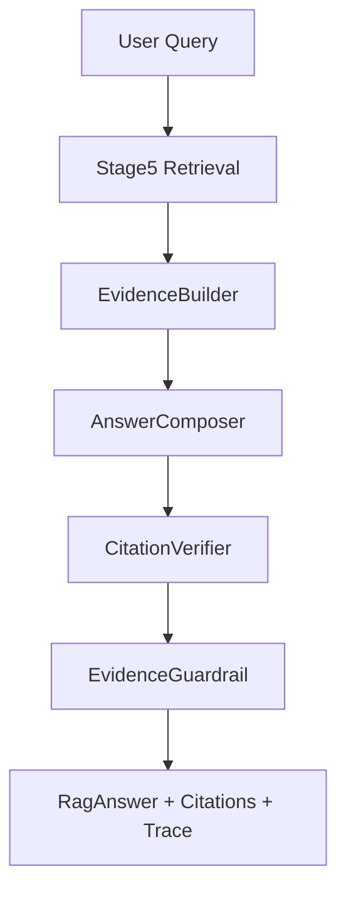

# 阶段六分阶段开发计划：Agent 服务化集成、可信引用与答案质量

## 0. 阶段定位

阶段六建立在已经收口的五个阶段之上：

```text
阶段一：Markdown 结构化解析 + Token chunk + BGE embedding + FAISS 基线
阶段二：Qdrant Local + SQLite Registry + Markdown 自动同步
阶段三：Qdrant dense + BM25 sparse + RRF + metadata filter + ContextPacker
阶段四：Cross-Encoder rerank + MMR 多样性控制
阶段五：Query Analyzer / Rewrite / Multi-Query / 条件 HyDE
```

前五个阶段解决的是“能不能更准地找到证据”。阶段六要解决的是“如何把证据变成 Agent 可以使用、用户可以信任、面试可以展示的问答结果”。

### 与原项目的集成策略

阶段六分两步：

- **第一步（6.1~6.6）**：在 `G:\tiaozhanbei\newrag` 独立项目中完成 `RagAnswerService`、Evidence/Citation、引用校验、证据不足降级、CLI 和 FastAPI。此时不触碰原多智能体项目。
- **第二步（阶段七或阶段六第二轮）**：通过 `legacy_adapter` 将 `RagAnswerService` 接入原项目 `disaster_response_agent.py` 的 `retrieve_node`，替换原有 `RAG.invoke()` 调用，并扩展 GraphState 加入 `citations` 和 `retrieval_trace`。

接入方式：

1. 先用 adapter 的 `invoke(query, top_k) -> List[str]` 保持兼容，验证不影响 `plan_agent` 流程；
2. 确认稳定后再扩展 GraphState，让 `propose_node` 能拿到结构化 citations；
3. GraphState 改造属于高风险操作，必须单独验证。

因此阶段六不再优先增加新的召回算法，而是围绕以下目标开发：

```text
Stage5 检索结果
→ Evidence 编号与结构化引用
→ 答案生成 / 模板生成
→ Citation 验证
→ 证据不足降级
→ CLI / FastAPI / Adapter 展示
```

---

## 1. 总体原则

1. **不破坏已收口阶段**
   - 不修改阶段一到阶段五的默认入口；
   - 不重建 chunk、BM25、Qdrant；
   - 不要求重新 embedding；
   - 新代码放入 `G:\tiaozhanbei\newrag\src\rag_v2\agent`。

2. **先无 LLM 跑通，再可选接 LLM**
   - 第一版答案生成采用 extractive/template 方式；
   - 单元测试不依赖 DeepSeek/OpenAI；
   - 后续可把 LLM composer 作为可选实现。

3. **引用优先于表达流畅**
   - 关键事实必须有 `[S1]`、`[S2]`；
   - 引用 ID 必须能映射到 chunk_id、source_file、section_path；
   - 不允许凭空补政策条款、响应等级、数字、责任主体。

4. **证据不足要显式降级**
   - 低分、无引用、引用不支持时，不输出确定性结论；
   - 输出“当前知识库没有足够依据”或“一般建议”；
   - trace 中记录 fallback_reason。

5. **面试展示友好**
   - CLI 输出 query_plan、matched_branches、evidence、final_answer；
   - FastAPI demo 返回 JSON；
   - 报告中能画出 Agentic RAG 闭环。

---

## 2. 阶段六最终链路

```text
user query
→ RagAnswerService.answer(query)
→ Stage5 MultiQueryPipeline 检索
→ ContextPacker 组装 evidence_chunks
→ EvidenceBuilder 生成 [S1]/[S2]/...
→ AnswerComposer 生成草稿答案
→ CitationVerifier 校验引用完整性
→ EvidenceGuardrail 判断是否证据不足
→ 返回 RagAnswer(answer, citations, evidence, trace)
```

建议数据流：



---

## 3. 小阶段拆分

## 6.1 Agent Schema 与 Citation 数据模型

### 目标

定义阶段六的输入输出合同，让后续服务、CLI、FastAPI、单测都使用同一套结构。

### 计划新增代码

- `G:\tiaozhanbei\newrag\src\rag_v2\agent\__init__.py`
- `G:\tiaozhanbei\newrag\src\rag_v2\agent\models.py`
- `G:\tiaozhanbei\newrag\tests\test_agent_models.py`

### 核心模型

建议包含：

- `EvidenceItem`
  - `citation_id`: `S1`
  - `chunk_id`
  - `source_file`
  - `section_path`
  - `content`
  - `score`
  - `rank`
- `Citation`
  - `citation_id`
  - `source_file`
  - `chunk_id`
  - `section_path_text`
- `RagAnswer`
  - `query`
  - `answer`
  - `citations`
  - `evidence`
  - `trace`
  - `fallback_reason`
- `AnswerTrace`
  - `query_plan`
  - `branches`
  - `retrieval_latency_ms`
  - `composer_mode`
  - `verification`

### 单元测试

- 模型能从 dict 构造；
- 能 JSON 序列化；
- citation_id 稳定；
- 空 evidence 时不会崩溃。

### 收敛标准

- 只新增 schema，不接检索；
- 全量测试通过；
- 不影响阶段一到阶段五。

### 是否需要你重点阅读

需要读。这里是阶段六的接口合同，面试官如果问“你怎么把检索结果交给 Agent”，核心就在这里。

---

## 6.2 RagAnswerService 封装 Stage5 检索链路

### 目标

把 `search_stage5.py` 中的脚本式流程封装为可复用 service，提供稳定的 Python API。

### 计划新增代码

- `G:\tiaozhanbei\newrag\src\rag_v2\agent\service.py`
- `G:\tiaozhanbei\newrag\tests\test_rag_answer_service.py`

### 核心接口

```python
service = RagAnswerService.from_config(...)
answer = service.answer("台风黄色预警下学校应该怎么做")
```

### 实现要点

1. 复用阶段五 `MultiQueryPipeline`；
2. 支持 fake pipeline 注入，方便单元测试；
3. 真实模型加载只放在 `from_config()`，不要在 import 时加载；
4. 失败时返回 fallback answer，而不是抛出到最外层；
5. trace 中保留 query_plan、branches、matched_branches、top evidence。

### 单元测试

- fake pipeline 返回 2 个 chunk 时，service 能生成基础 `RagAnswer`；
- pipeline 抛异常时，service 返回 fallback_reason；
- trace 字段存在；
- 不加载真实 BGE/reranker。

### 收敛标准

- service API 可用；
- CLI/FastAPI 暂不做；
- 不跑 GPU。

### 是否需要你重点阅读

需要读。它是阶段六的主入口，也是后续接 Agent、Web API、原项目 adapter 的核心。

---

## 6.3 EvidenceBuilder 与模板答案生成

### 目标

让系统即使不接真实 LLM，也能基于证据生成一段带引用的结构化答案。

### 计划新增代码

- `G:\tiaozhanbei\newrag\src\rag_v2\agent\evidence.py`
- `G:\tiaozhanbei\newrag\src\rag_v2\agent\composer.py`
- `G:\tiaozhanbei\newrag\tests\test_evidence_builder.py`
- `G:\tiaozhanbei\newrag\tests\test_answer_composer.py`

### 答案格式建议

```text
根据知识库检索结果，可以这样处理：

1. 处置建议：……[S1]
2. 启动/责任主体：……[S2]
3. 注意事项：……[S3]

来源：
[S1] 深圳市气象灾害应急预案.md / 3.3.3.2 Ⅳ级应急响应（一般）
[S2] 国家气象灾害应急预案-2.md / （一）IV级响应
```

### 实现要点

1. EvidenceBuilder 对 `evidence_chunks` 按 `fusion_score` / `score` 降序后编号 `[S1]`、`[S2]`；
2. 同一 chunk 只分配一个 `citation_id`，来源列表按 rank 排序，同一 chunk 只出现一次；
3. TemplateAnswerComposer 抽取前若干条 evidence 的关键句；
4. 数字、响应等级、责任主体尽量保留原文，不改写；
5. 输出中所有 `[Sx]` 必须来自 citations；
6. 答案中的数字、响应等级、条款号、责任主体必须来自 evidence 原文，不得改写；
7. 从 evidence 中提取的关键句以 `[Sx]` 标记结尾；
8. 如果所有 evidence 的 retrieval score 均低于阈值，默认 `fusion_score < 0.3`，输出“当前知识库未覆盖该问题，以下为一般建议”；
9. 答案分段时，每段标注信息来源，例如“处置建议：……[S1][S3]”、“启动条件：……[S2]”、“注意事项：……[S4]”；
10. 阈值由 `EvidenceGuardrail` 配置控制，当前 0.3 是初始经验值，不作为最终评测结论。

### 单元测试

- `[S1]`、`[S2]` 编号稳定；
- 来源列表与 evidence 一一对应；
- 空 evidence 返回证据不足答案；
- 重复 chunk 不重复编号。

### 收敛标准

- 无 LLM 也能输出可展示答案；
- 生成内容不依赖 GPU；
- 不影响 Stage5 search CLI。

### 是否需要你重点阅读

建议读 `evidence.py` 和 `composer.py` 的核心函数。面试中“可信引用怎么做”基本来自这里。

---

## 6.4 CitationVerifier 与 Evidence Guardrail

### 目标

把“答案末尾列来源”升级为“答案中的引用可校验、证据不足可降级”。

### 计划新增代码

- `G:\tiaozhanbei\newrag\src\rag_v2\agent\verifier.py`
- `G:\tiaozhanbei\newrag\src\rag_v2\agent\guardrail.py`
- `G:\tiaozhanbei\newrag\tests\test_citation_verifier.py`
- `G:\tiaozhanbei\newrag\tests\test_evidence_guardrail.py`

### 校验规则

第一版做确定性规则即可：

1. 答案中出现的 `[Sx]` 必须存在于 citations；
2. citations 中不能存在无 evidence 的引用；
3. 如果答案含有 `IV级`、`Ⅳ级`、数字、年份、条款号，至少要有引用；
4. 最高 evidence score 低于阈值时标记 `insufficient_evidence`；
5. evidence 数量低于阈值时标记 `insufficient_evidence`；
6. 不做复杂语义 verifier，避免阶段六过重。

### Guardrail 输出

```python
{
  "passed": false,
  "reasons": ["missing_citation", "low_retrieval_score"],
  "fallback_answer": "当前知识库没有足够依据回答该问题。"
}
```

### 单元测试

- 未定义引用 `[S9]` 能被检出；
- 有数字但无引用能被检出；
- 低分 evidence 触发证据不足；
- 正常答案通过校验。

### 收敛标准

- verifier/guardrail 可独立测试；
- 不接真实 LLM；
- 不新增复杂模型依赖。

### 是否需要你重点阅读

需要读。它是把项目从“检索 demo”提升到“可信 RAG”的关键，也是简历亮点。

---

## 6.5 CLI / FastAPI Demo 与 Adapter

### 目标

把阶段六能力变成可以演示的接口，并为将来接回原多智能体项目保留 adapter。

### 计划新增代码

- `G:\tiaozhanbei\newrag\scripts\answer_stage6.py`
- `G:\tiaozhanbei\newrag\src\rag_v2\agent\api.py`
- `G:\tiaozhanbei\newrag\src\rag_v2\agent\legacy_adapter.py`
- `G:\tiaozhanbei\newrag\tests\test_agent_adapter.py`

### CLI 示例

```bash
python scripts/answer_stage6.py "台风黄色预警下学校应该怎么做" --top-k 5 --no-llm
```

### FastAPI 示例

```bash
uvicorn rag_v2.agent.api:app --host 0.0.0.0 --port 8000
```

接口：

```text
POST /answer
{
  "query": "台风黄色预警下学校应该怎么做",
  "top_k": 5,
  "hyde_mode": "disabled"
}
```

返回：

```json
{
  "answer": "... [S1]",
  "citations": [...],
  "evidence": [...],
  "trace": {...},
  "fallback_reason": null
}
```

### Adapter 策略

`legacy_adapter.py` 第一版同时提供两个接口：

```python
# 兼容原 RAG 接口：返回 evidence chunk 原文列表
# 用于未来替换原项目 retrieve_node 中的 RAG.invoke(query, top_k)
def invoke(query: str, top_k: int = 10) -> list[str]:
    ...

# 新接口：返回完整 RagAnswer，含 citations、evidence、trace
# 用于后续 propose_node / Agent 状态扩展
def answer(query: str, top_k: int = 10) -> RagAnswer:
    ...
```

`invoke()` 是保底兼容接口，目标是尽量不改原 `plan_agent` 流程；`answer()` 是阶段六独立服务和后续 GraphState 改造的真正目标。阶段六只实现 adapter，不直接修改 `G:\tiaozhanbei\Youan-AI-main`。

### 单元测试

- CLI 参数解析可以构造 service options；
- FastAPI app 可 import，不加载模型；
- adapter 能把 `RagAnswer` 转成字符串；
- fake service 测试通过。

### 收敛标准

- 一条命令可本地演示；
- FastAPI 可启动；
- 不强制真实 GPU/LLM。

### 是否需要你重点阅读

CLI 和 FastAPI 不需要重点读。`legacy_adapter.py` 可以了解，因为它关系到怎么把独立 RAG 项目接回原多智能体项目。

---

## 6.6 阶段六评测、报告与收口（✅ 已完成）

### 目标

完成阶段六的轻量评测和文档闭环，形成“可写简历”的阶段成果。

### 计划新增代码/文档

- `G:\tiaozhanbei\newrag\evaluate_stage6.py` 或复用简单 smoke 脚本；
- `G:\tiaozhanbei\newrag\scripts\generate_phase6_report.py`；
- `G:\tiaozhanbei\newrag\artifacts\stage6\stage6_eval.json`；
- `G:\tiaozhanbei\newrag\artifacts\stage6\phase6_report.md`；
- `G:\tiaozhanbei\aidoc\RAG优化\阶段六收口说明.md`。

### 评测内容

不追求大规模真实人工评测，重点验证工程闭环：

1. 10 条 query 能返回 answer；
2. 每个 answer 至少包含 1 个有效 citation；
3. 所有 `[Sx]` 都能映射到 evidence；
4. 证据不足 query 能触发 fallback；
5. trace 中包含 query_plan、branches、top evidence；
6. legacy hash 不变。

### 单元测试

- 全量 `pytest tests -q`；
- `scripts/check_legacy_hash.py`；
- CLI smoke；
- FastAPI import smoke。

### 收敛标准

- 阶段六报告生成；
- 文档说明新增功能、代码结构、阅读建议、面试回答；
- 可以进入阶段七或停止开发用于简历包装。

### 是否需要你重点阅读

收口报告需要读。评测脚本不需要细读，知道它验证了引用完整性和证据不足即可。

---

## 4. 阶段六完成后应该达到的效果

阶段六完成后，项目应该从“检索增强组件”升级为“可演示的 Agentic RAG 问答服务”：

1. 用户输入自然语言问题；
2. 系统自动进行 Query Analyzer、Rewrite、Multi-Query、HyDE 可选增强；
3. 使用 Qdrant + BM25 + RRF + rerank + MMR 找到证据；
4. 把证据编号为 `[S1]`、`[S2]`；
5. 输出带引用的结构化答案；
6. 如果证据不足，明确拒答或降级为一般建议；
7. 返回完整 trace，能解释为什么召回这些文档；
8. 可以通过 CLI 或 FastAPI 演示；
9. 可以用 adapter 为接回原多智能体项目做准备；阶段六不直接修改原项目，GraphState 改造留到阶段七。

简历上可以写成：

> 将检索链路封装为 Agentic RAG 问答服务，设计 Evidence/Citation 数据模型、引用校验与证据不足降级机制，实现从 Query Planning、多路召回、Cross-Encoder 精排到可信答案生成的完整闭环，并提供 CLI/FastAPI 演示接口。

---

## 5. 是否需要 GPU

阶段六开发本身 **不需要 GPU**。

原因：

- 6.1 schema：纯 Python；
- 6.2 service：单测用 fake pipeline；
- 6.3 evidence/composer：纯文本处理；
- 6.4 verifier/guardrail：规则校验；
- 6.5 CLI/FastAPI：工程封装；
- 6.6 收口评测：可以用 fake retrieval 或少量 CPU smoke。

只有两种情况建议使用 GPU：

1. 你想跑真实 Stage5 检索 + reranker 的较大规模效果评测；
2. 你想用 AutoDL 展示真实端到端延迟，包括 BGE embedding 和 bge-reranker。

如果只是阶段六开发和单元测试，本地 CPU 足够。若要做 20~50 条真实 query 的完整端到端评测，建议等代码写完后再去 AutoDL 一次性跑，避免频繁租服务器。

---

## 6. 阶段六建议开发顺序

严格按下面顺序开发：

1. 6.1：先定义 `agent/models.py`；
2. 6.2：封装 `RagAnswerService`，用 fake pipeline 单测；
3. 6.3：做 EvidenceBuilder 和 TemplateAnswerComposer；
4. 6.4：做 CitationVerifier 和 EvidenceGuardrail；
5. 6.5：做 CLI、FastAPI、legacy adapter；
6. 6.6：做阶段六 smoke、报告和收口文档。

不要提前做真实 LLM 生成，也不要在阶段六直接修改原项目。先把“可引用、可验证、可降级”的 Agentic RAG 闭环跑通；真实 LLM 生成和 GraphState 改造留到阶段七。


